# Canada_Calibrate COPD Exacerbations

``` r
library(epicR)
#> epicR: Using config files from: /home/runner/.epicR/config
#> To reset configs to defaults, use: reset_user_configs()
#> 
#> Attaching package: 'epicR'
#> The following object is masked from 'package:stats':
#> 
#>     simulate
```

### Previous Calibration

Assessing calibration of exacerbations with previous EPIC’s (v0.31.3)
equations:

``` r
inputs <- get_input()$values
inputs$exacerbation$ln_rate_betas = t(as.matrix(c(intercept = -3.4, female = 0, age = 0.04082 * 0.1, fev1 = -0, smoking_status = 0, gold1 = 1.4 , gold2 = 2.0 , gold3 = 2.4 , gold4 = 2.8 , diagnosis_effect = 0.9)))
validate_exacerbation(1e4, inputs)
#> Initializing the session
#> Working directory: /home/runner/work/epicR/epicR/vignettes
#> Running EPIC model (with custom input parameters)
#> Record mode: record_mode_event (2)
#> Simulating 10000 base agents: 10% 20% 30% 40% 50%
#> 60% 70% 80% 90% 100%
#> Terminating the session
#> Exacerbation Rates per GOLD stages for all patients:
#> exacRateGOLDI   = 0.22
#> exacRateGOLDII  = 0.4
#> exacRateGOLDIII = 0.56
#> exacRateGOLDIV  = 0.85
```

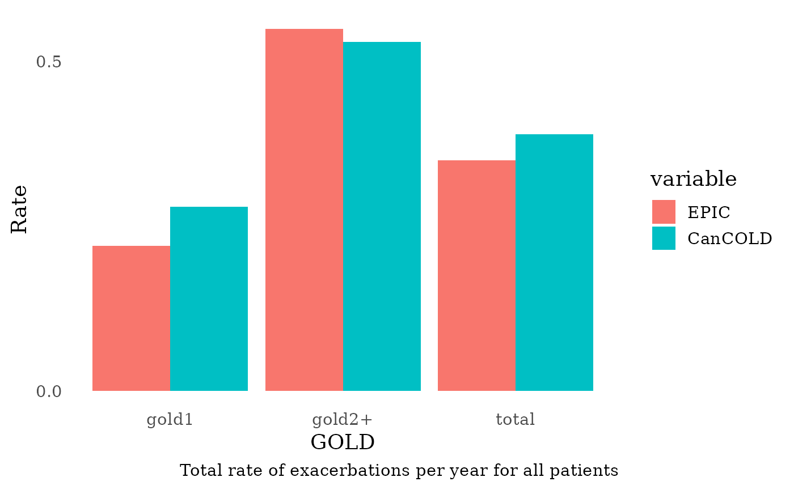

    #> Total rate of exacerbation in all patients (0.39 per year in CanCOLD): 0.35
    #> Is the rate of severe and very severe exacerbations around 477 per CIHI?
    #> Average rate during 20 years: 292.32
    #> Rate in 2017: 195.29

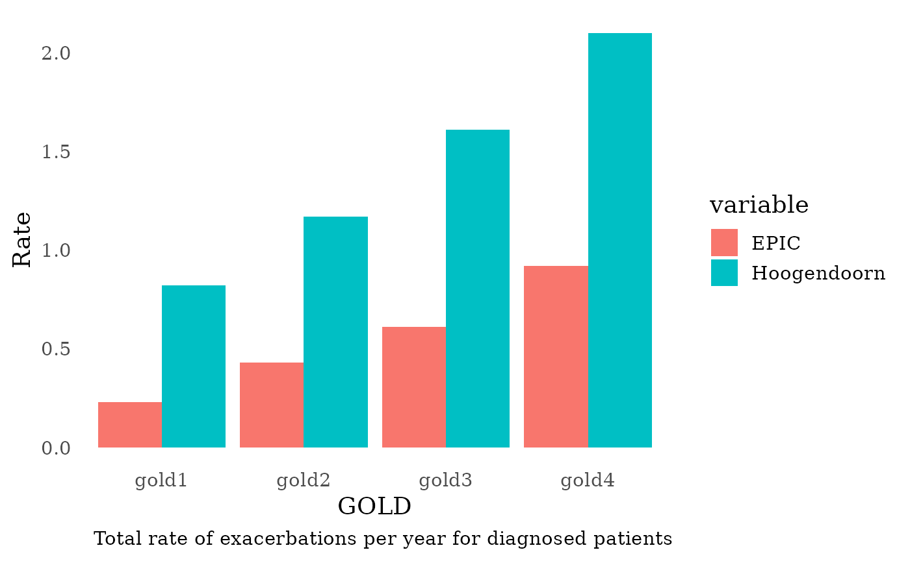

    #> Total rate of exacerbation in diagnosed patients (1.5 per year in Hoogendoorn): 0.42

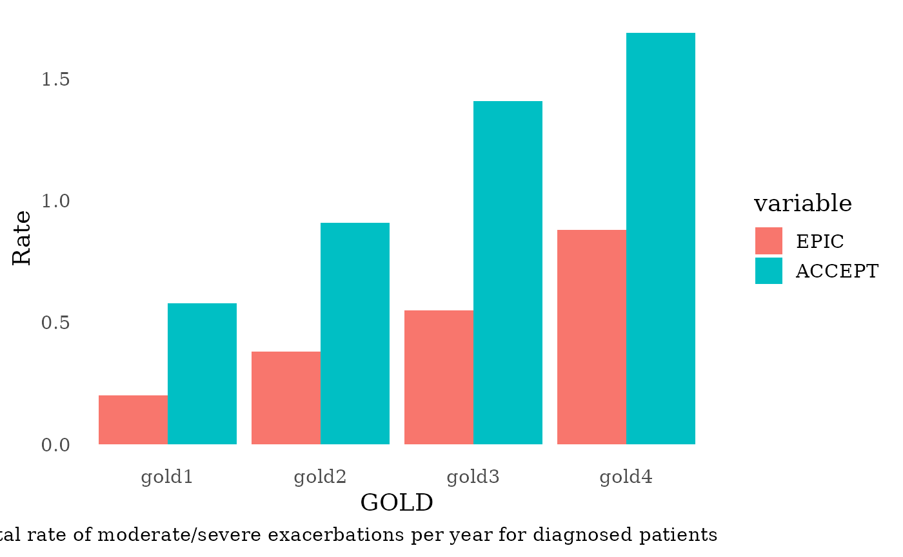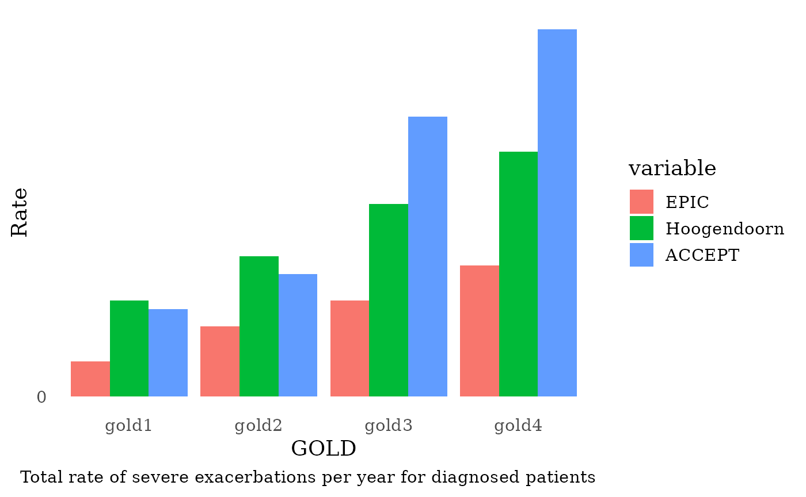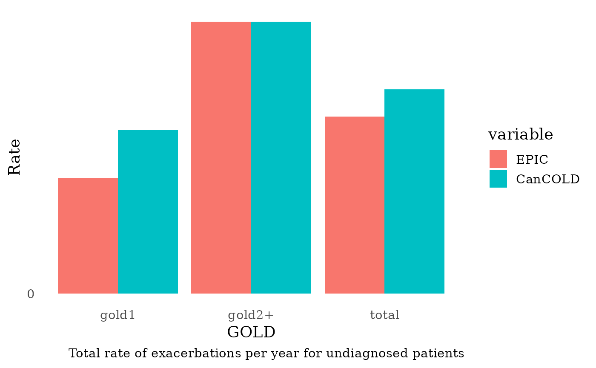

    #> Total rate of exacerbation in undiagnosed patients (0.30 per year in CanCOLD): 0.26
    #> 
    #> Exacerbation rates (per COPD patient-year) by sex over time:

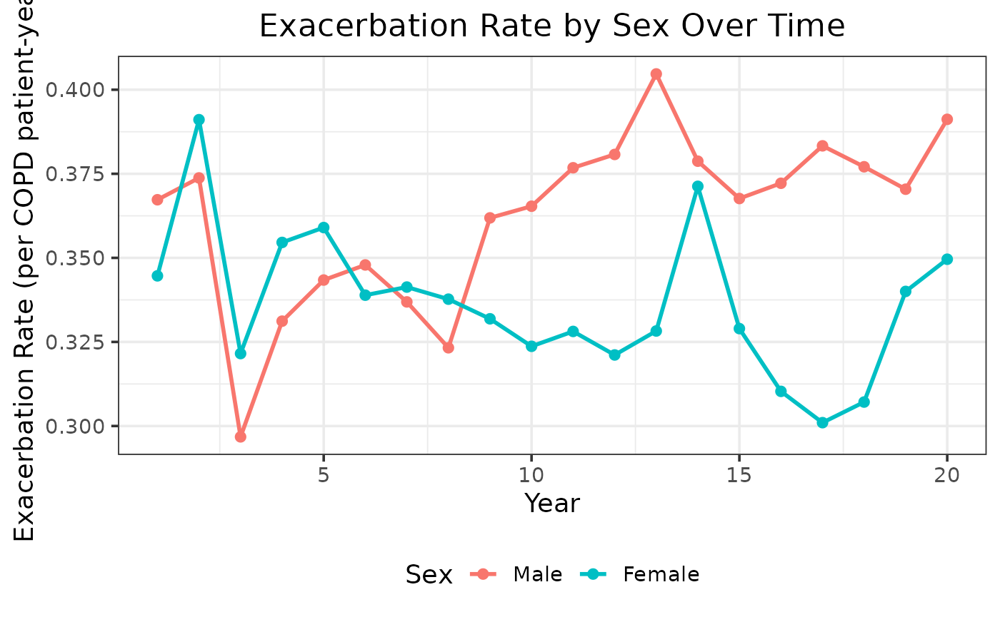

    #> 
    #> Summary statistics:
    #> Total exacerbations (Male): 5060
    #> Total exacerbations (Female): 4784
    #> Total COPD patient-years (Male): 13903
    #> Total COPD patient-years (Female): 14257
    #> Mean exacerbation rate per COPD patient-year (Male): 0.3625
    #> Mean exacerbation rate per COPD patient-year (Female): 0.3365
    #> Overall exacerbation rate per COPD patient-year (Male): 0.364
    #> Overall exacerbation rate per COPD patient-year (Female): 0.3356

This equation for exacerbations included a term for diagnosis. As a
result, whether a person was diagnosed or not would affect the
exacerbation rates, which does not have causal face validity, and is
particularly undesirable for case detection studies that assess
diagnosis.

If we remove the diagnosis term and go back to the previous calibration,
it will look like this:

``` r
inputs$exacerbation$ln_rate_betas <- t(as.matrix(c(intercept = 1.7, female = 0, age = 0.04082 * 0.1, fev1 = -1.5, smoking_status = 0, gold1 = 0.6 , gold2 = 0.35 , gold3 = 0.08 , gold4 = -0.35 , diagnosis_effect = 0)))
validate_exacerbation(1e4, inputs)
#> Initializing the session
#> Working directory: /home/runner/work/epicR/epicR/vignettes
#> Running EPIC model (with custom input parameters)
#> Record mode: record_mode_event (2)
#> Simulating 10000 base agents: 10% 20% 30% 40% 50%
#> 60% 70% 80% 90% 100%
#> Terminating the session
#> Exacerbation Rates per GOLD stages for all patients:
#> exacRateGOLDI   = 0.48
#> exacRateGOLDII  = 0.87
#> exacRateGOLDIII = 1.5
#> exacRateGOLDIV  = 1.83
```

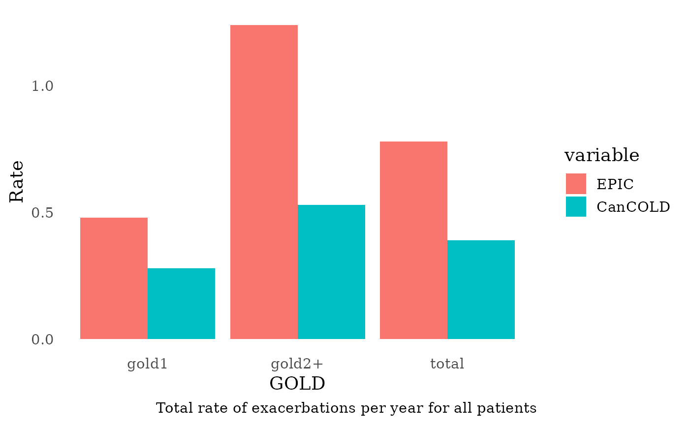

    #> Total rate of exacerbation in all patients (0.39 per year in CanCOLD): 0.78
    #> Is the rate of severe and very severe exacerbations around 477 per CIHI?
    #> Average rate during 20 years: 674.96
    #> Rate in 2017: 733.86

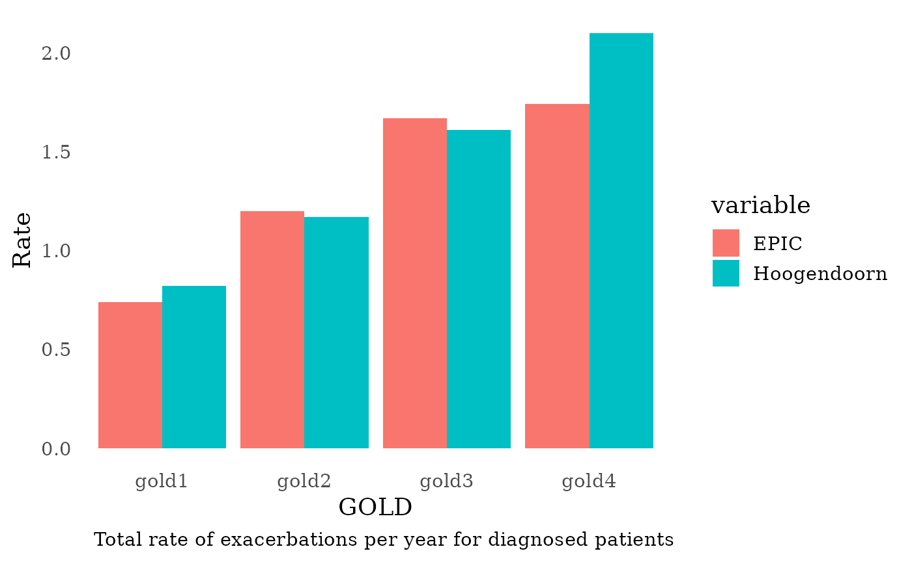

    #> Total rate of exacerbation in diagnosed patients (1.5 per year in Hoogendoorn): 1.15

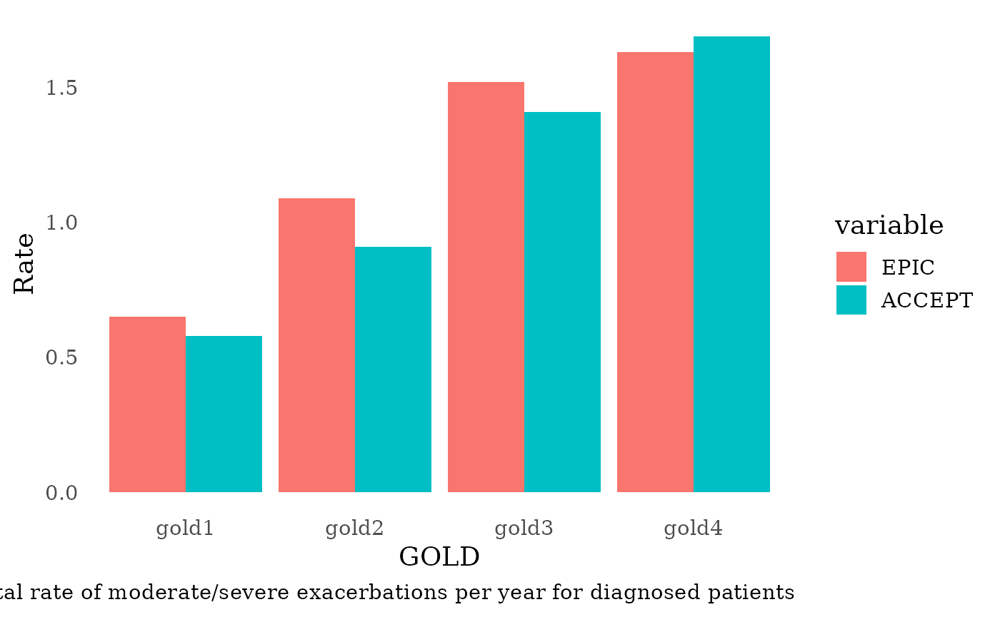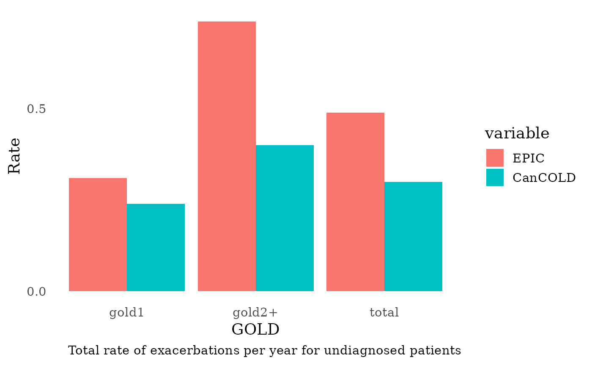

    #> Total rate of exacerbation in undiagnosed patients (0.30 per year in CanCOLD): 0.49
    #> 
    #> Exacerbation rates (per COPD patient-year) by sex over time:

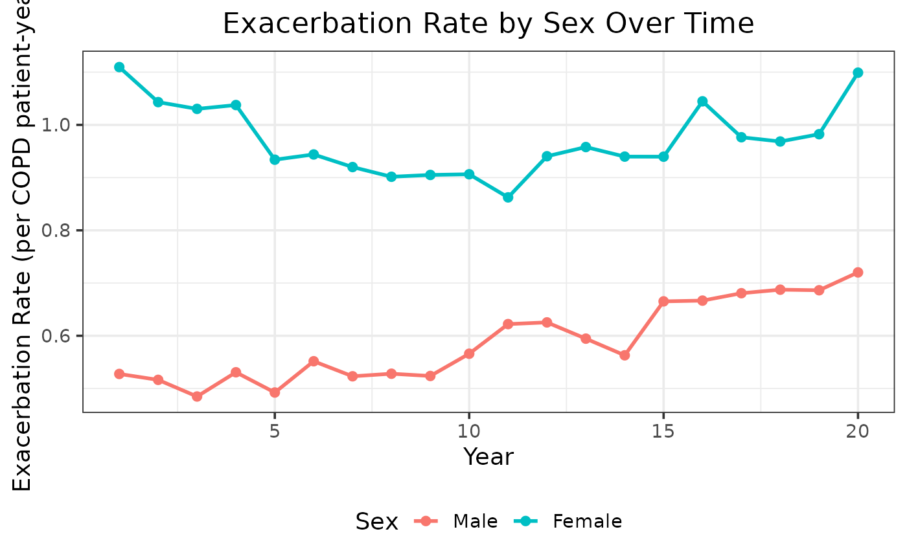

    #> 
    #> Summary statistics:
    #> Total exacerbations (Male): 7793
    #> Total exacerbations (Female): 12918
    #> Total COPD patient-years (Male): 13102
    #> Total COPD patient-years (Female): 13294
    #> Mean exacerbation rate per COPD patient-year (Male): 0.5878
    #> Mean exacerbation rate per COPD patient-year (Female): 0.9722
    #> Overall exacerbation rate per COPD patient-year (Male): 0.5948
    #> Overall exacerbation rate per COPD patient-year (Female): 0.9717

The following recalibrations were assesses and Recalibration 5 was
implemented in `epicR v0.35.0`

### Recalibration 1:

Let’s try to improve that by lowering GOLD coefficients:

``` r
inputs$exacerbation$ln_rate_betas <- t(as.matrix(c(intercept = 1.7, female = 0, age = 0.04082 * 0.1, fev1 = -1.5, smoking_status = 0, gold1 = 0.3 , gold2 = 0.1 , gold3 = 0.08 , gold4 = -0.35 , diagnosis_effect = 0)))
validate_exacerbation(1e4, inputs)
#> Initializing the session
#> Working directory: /home/runner/work/epicR/epicR/vignettes
#> Running EPIC model (with custom input parameters)
#> Record mode: record_mode_event (2)
#> Simulating 10000 base agents: 10% 20% 30% 40% 50%
#> 60% 70% 80% 90% 100%
#> Terminating the session
#> Exacerbation Rates per GOLD stages for all patients:
#> exacRateGOLDI   = 0.37
#> exacRateGOLDII  = 0.66
#> exacRateGOLDIII = 1.63
#> exacRateGOLDIV  = 2.24
```

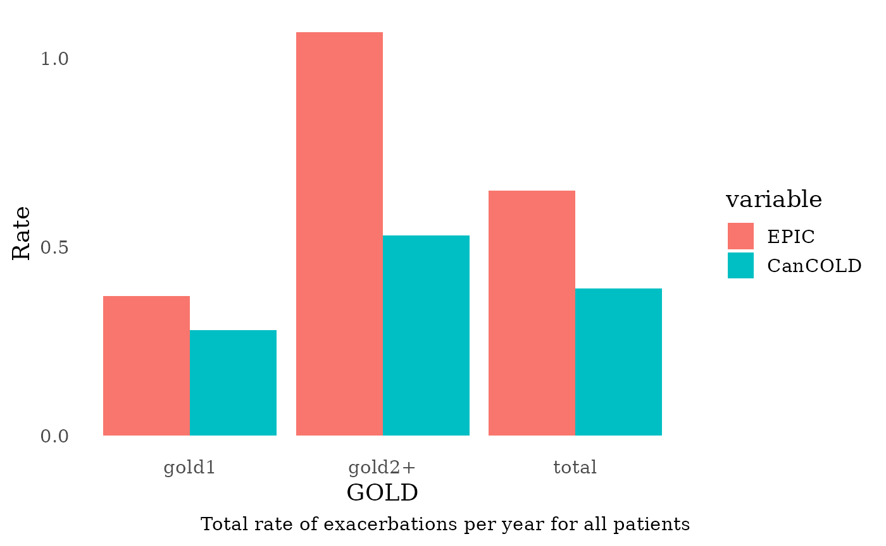

    #> Total rate of exacerbation in all patients (0.39 per year in CanCOLD): 0.65
    #> Is the rate of severe and very severe exacerbations around 477 per CIHI?
    #> Average rate during 20 years: 626.52
    #> Rate in 2017: 606.12

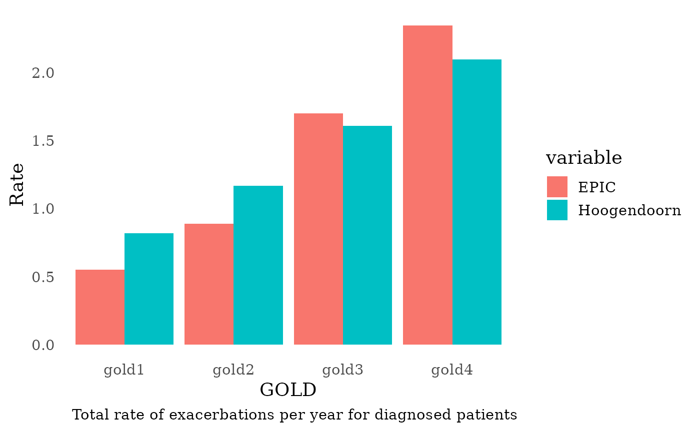

    #> Total rate of exacerbation in diagnosed patients (1.5 per year in Hoogendoorn): 0.95

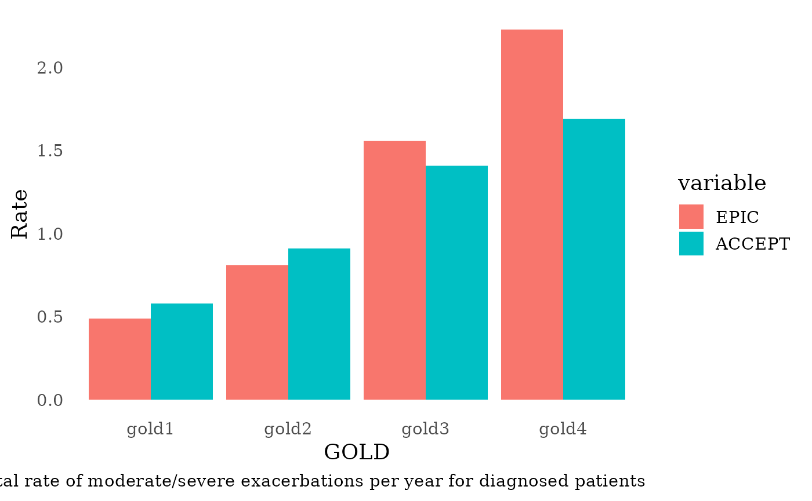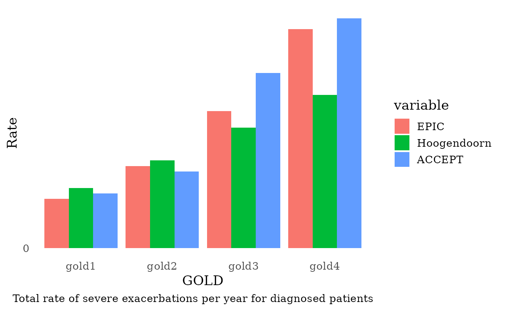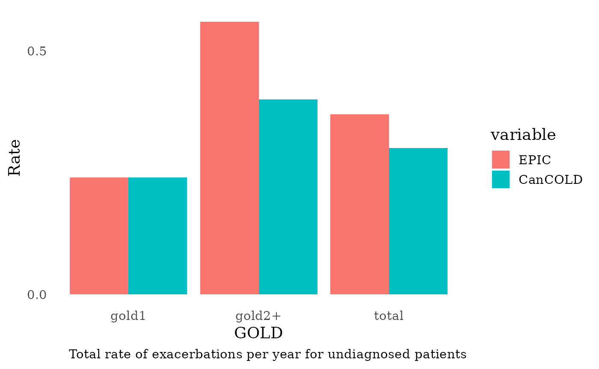

    #> Total rate of exacerbation in undiagnosed patients (0.30 per year in CanCOLD): 0.37
    #> 
    #> Exacerbation rates (per COPD patient-year) by sex over time:

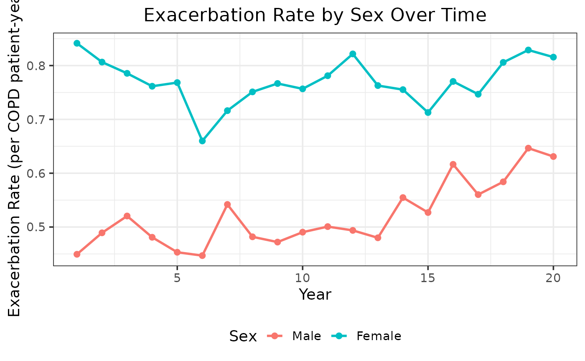

    #> 
    #> Summary statistics:
    #> Total exacerbations (Male): 6699
    #> Total exacerbations (Female): 10851
    #> Total COPD patient-years (Male): 12745
    #> Total COPD patient-years (Female): 14070
    #> Mean exacerbation rate per COPD patient-year (Male): 0.5211
    #> Mean exacerbation rate per COPD patient-year (Female): 0.7708
    #> Overall exacerbation rate per COPD patient-year (Male): 0.5256
    #> Overall exacerbation rate per COPD patient-year (Female): 0.7712

### Recalibration 2:

We can now lower GOLD2 coefficient even more and perhaps increase
smoking coefficient to compensate for the loss in the diagnosed
patients.

``` r
inputs$exacerbation$ln_rate_betas <- t(as.matrix(c(intercept = 1.7, female = 0, age = 0.04082 * 0.1, fev1 = -1.5, smoking_status = 0.5, gold1 = 0.3 , gold2 = 0.05 , gold3 = 0.08 , gold4 = -0.35 , diagnosis_effect = 0)))
validate_exacerbation(1e4, inputs)
#> Initializing the session
#> Working directory: /home/runner/work/epicR/epicR/vignettes
#> Running EPIC model (with custom input parameters)
#> Record mode: record_mode_event (2)
#> Simulating 10000 base agents: 10% 20% 30% 40% 50%
#> 60% 70% 80% 90% 100%
#> Terminating the session
#> Exacerbation Rates per GOLD stages for all patients:
#> exacRateGOLDI   = 0.42
#> exacRateGOLDII  = 0.75
#> exacRateGOLDIII = 1.61
#> exacRateGOLDIV  = 1.97
```

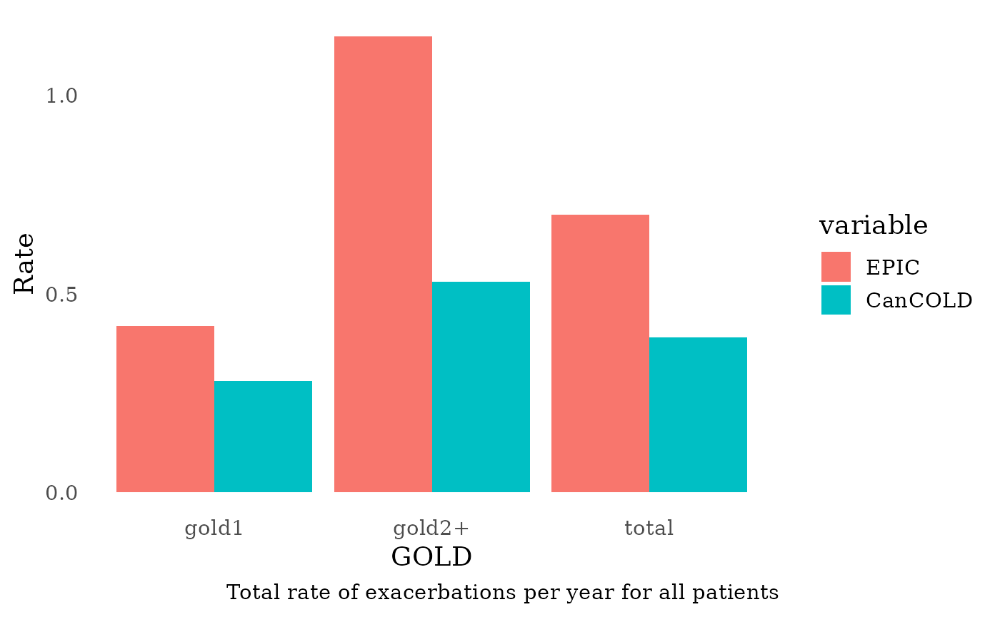

    #> Total rate of exacerbation in all patients (0.39 per year in CanCOLD): 0.7
    #> Is the rate of severe and very severe exacerbations around 477 per CIHI?
    #> Average rate during 20 years: 624.43
    #> Rate in 2017: 750.93

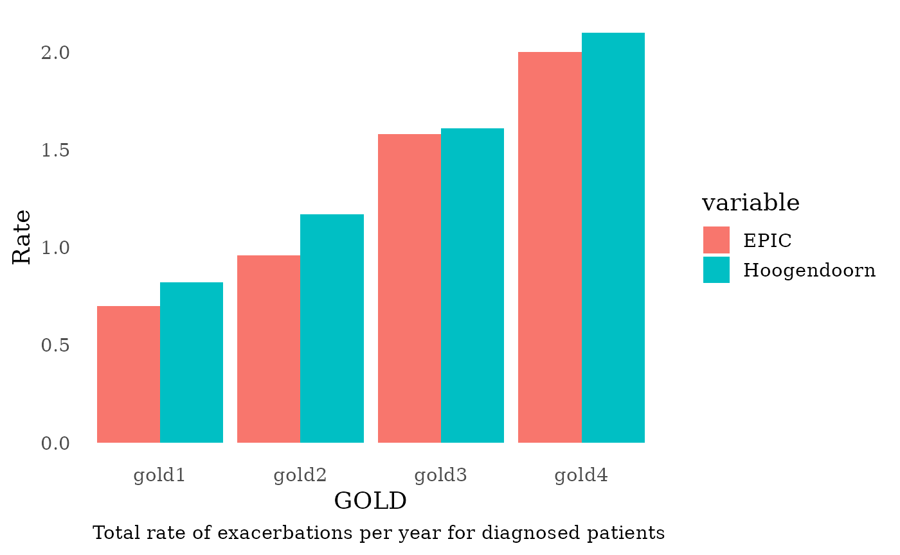

    #> Total rate of exacerbation in diagnosed patients (1.5 per year in Hoogendoorn): 1.01

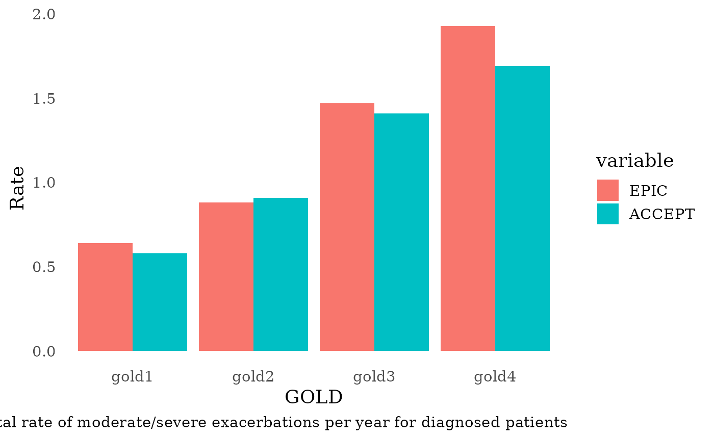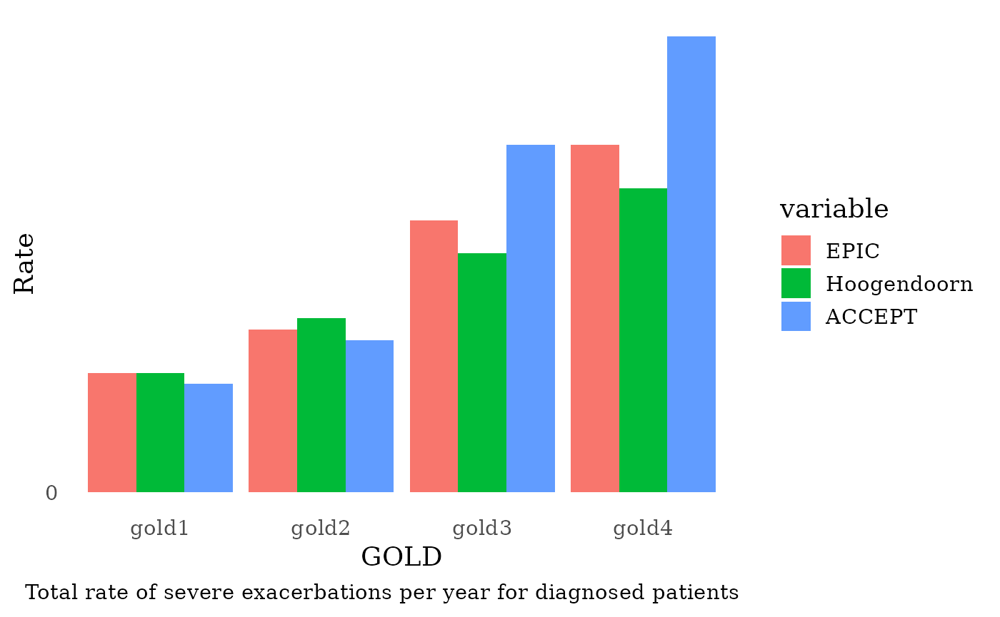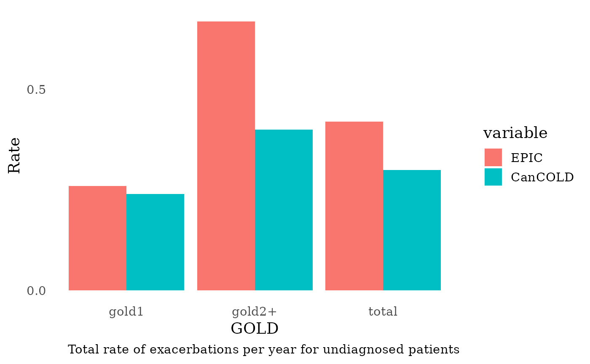

    #> Total rate of exacerbation in undiagnosed patients (0.30 per year in CanCOLD): 0.42
    #> 
    #> Exacerbation rates (per COPD patient-year) by sex over time:


    #> 
    #> Summary statistics:
    #> Total exacerbations (Male): 6554
    #> Total exacerbations (Female): 12656
    #> Total COPD patient-years (Male): 12287
    #> Total COPD patient-years (Female): 14762
    #> Mean exacerbation rate per COPD patient-year (Male): 0.5302
    #> Mean exacerbation rate per COPD patient-year (Female): 0.8574
    #> Overall exacerbation rate per COPD patient-year (Male): 0.5334
    #> Overall exacerbation rate per COPD patient-year (Female): 0.8573

### Recalibration 3:

Let’s lower GOLD2 dramatically:

``` r
inputs$exacerbation$ln_rate_betas <- t(as.matrix(c(intercept = 1.7, female = 0, age = 0.04082 * 0.1, fev1 = -1.5, smoking_status = 0.5, gold1 = 0.3 , gold2 = -0.5 , gold3 = 0.08 , gold4 = -0.35 , diagnosis_effect = 0)))
validate_exacerbation(1e4, inputs)
#> Initializing the session
#> Working directory: /home/runner/work/epicR/epicR/vignettes
#> Running EPIC model (with custom input parameters)
#> Record mode: record_mode_event (2)
#> Simulating 10000 base agents: 10% 20% 30% 40% 50%
#> 60% 70% 80% 90% 100%
#> Terminating the session
#> Exacerbation Rates per GOLD stages for all patients:
#> exacRateGOLDI   = 0.38
#> exacRateGOLDII  = 0.41
#> exacRateGOLDIII = 1.65
#> exacRateGOLDIV  = 2.18
```

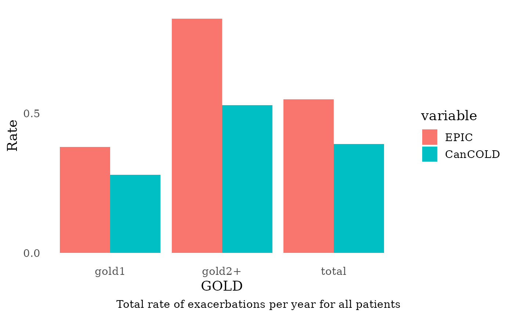

    #> Total rate of exacerbation in all patients (0.39 per year in CanCOLD): 0.55
    #> Is the rate of severe and very severe exacerbations around 477 per CIHI?
    #> Average rate during 20 years: 557.3
    #> Rate in 2017: 517.28

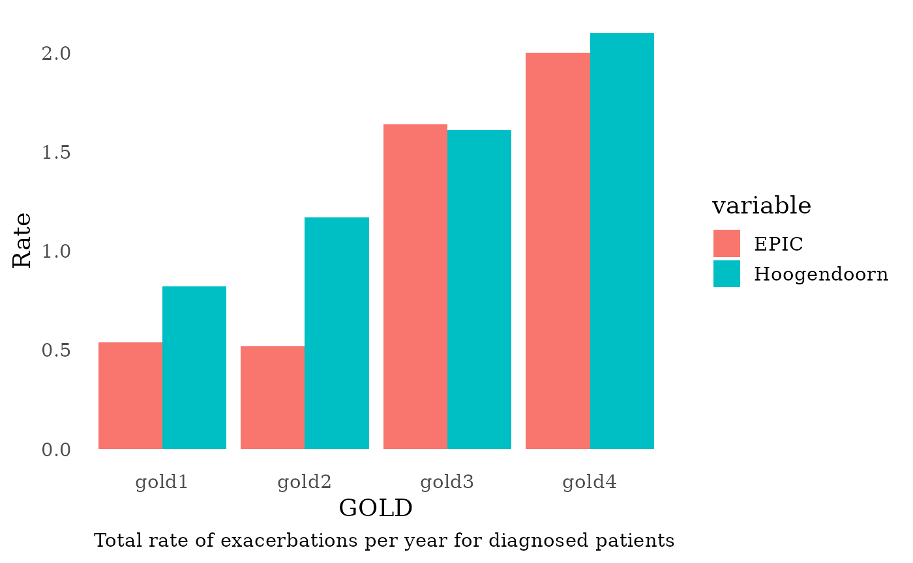

    #> Total rate of exacerbation in diagnosed patients (1.5 per year in Hoogendoorn): 0.76

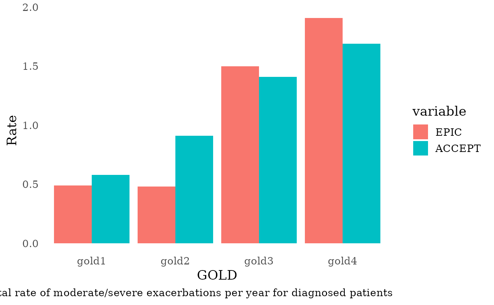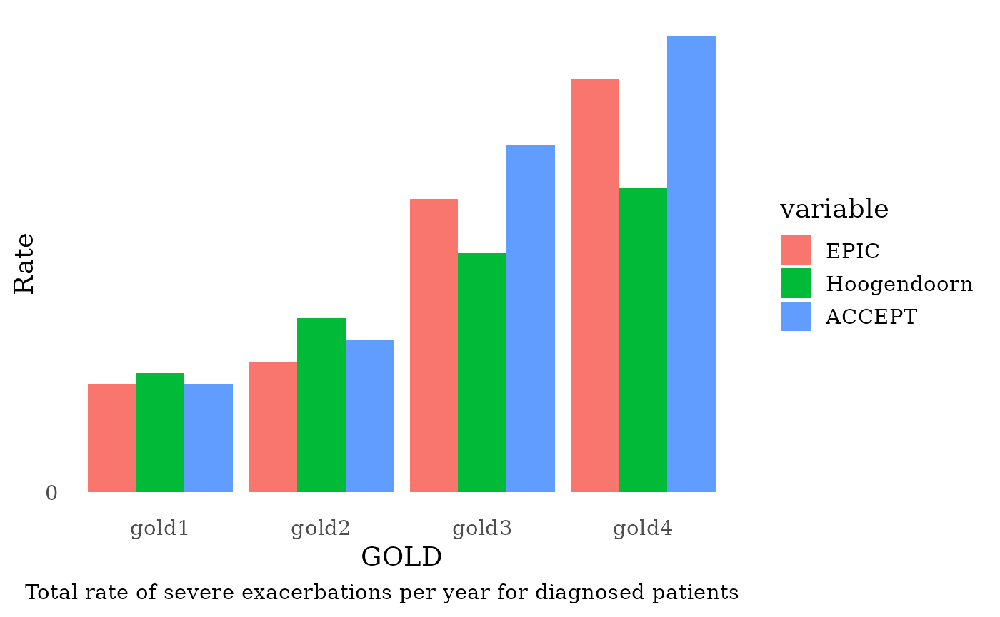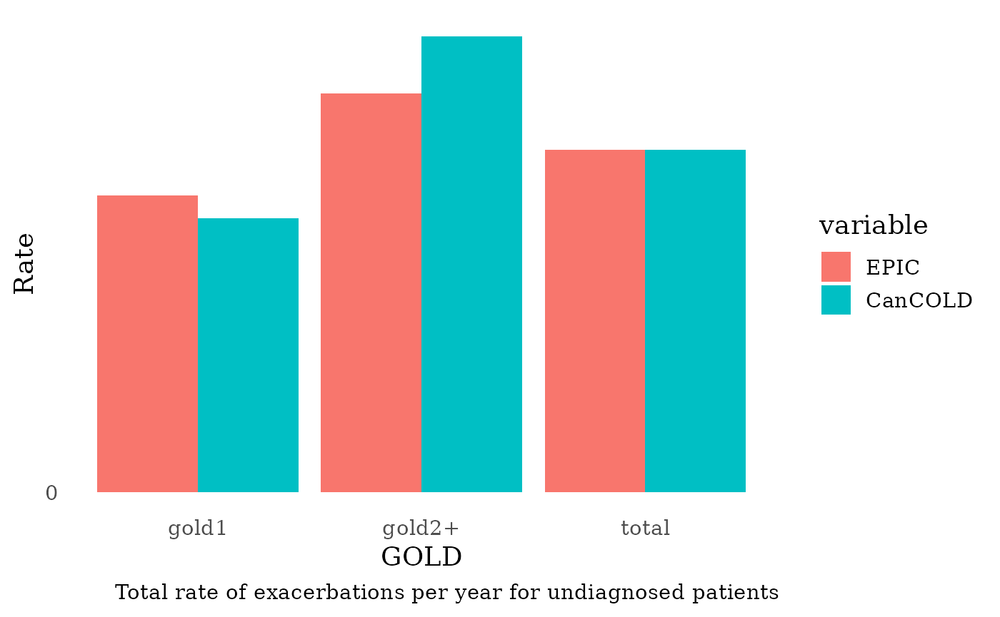

    #> Total rate of exacerbation in undiagnosed patients (0.30 per year in CanCOLD): 0.3
    #> 
    #> Exacerbation rates (per COPD patient-year) by sex over time:

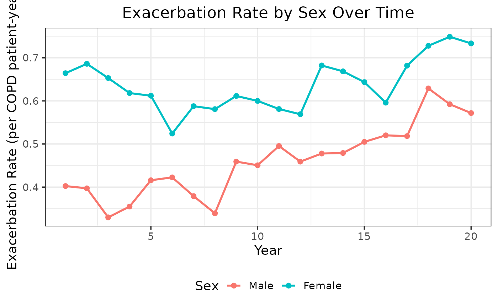

    #> 
    #> Summary statistics:
    #> Total exacerbations (Male): 6071
    #> Total exacerbations (Female): 8390
    #> Total COPD patient-years (Male): 13012
    #> Total COPD patient-years (Female): 13069
    #> Mean exacerbation rate per COPD patient-year (Male): 0.46
    #> Mean exacerbation rate per COPD patient-year (Female): 0.6385
    #> Overall exacerbation rate per COPD patient-year (Male): 0.4666
    #> Overall exacerbation rate per COPD patient-year (Female): 0.642

### Recalibration 4:

Bring GOLD2 up a bit:

``` r
inputs$exacerbation$ln_rate_betas <- t(as.matrix(c(intercept = 1.7, female = 0, age = 0.04082 * 0.1, fev1 = -1.5, smoking_status = 0.5, gold1 = 0.3 , gold2 = -0.2 , gold3 = 0.08 , gold4 = -0.35 , diagnosis_effect = 0)))
validate_exacerbation(1e4, inputs)
#> Initializing the session
#> Working directory: /home/runner/work/epicR/epicR/vignettes
#> Running EPIC model (with custom input parameters)
#> Record mode: record_mode_event (2)
#> Simulating 10000 base agents: 10% 20% 30% 40% 50%
#> 60% 70% 80% 90% 100%
#> Terminating the session
#> Exacerbation Rates per GOLD stages for all patients:
#> exacRateGOLDI   = 0.38
#> exacRateGOLDII  = 0.57
#> exacRateGOLDIII = 1.77
#> exacRateGOLDIV  = 2.2
```


    #> Total rate of exacerbation in all patients (0.39 per year in CanCOLD): 0.64
    #> Is the rate of severe and very severe exacerbations around 477 per CIHI?
    #> Average rate during 20 years: 658.59
    #> Rate in 2017: 439.28

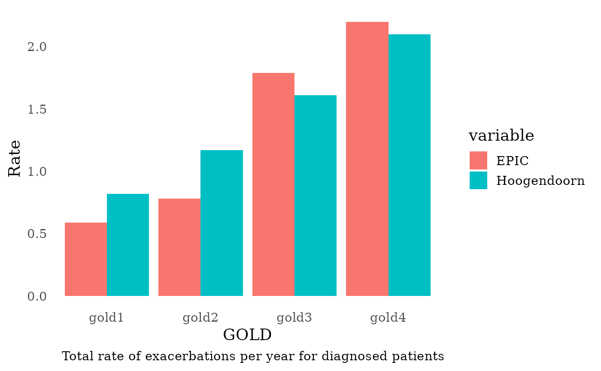

    #> Total rate of exacerbation in diagnosed patients (1.5 per year in Hoogendoorn): 0.97

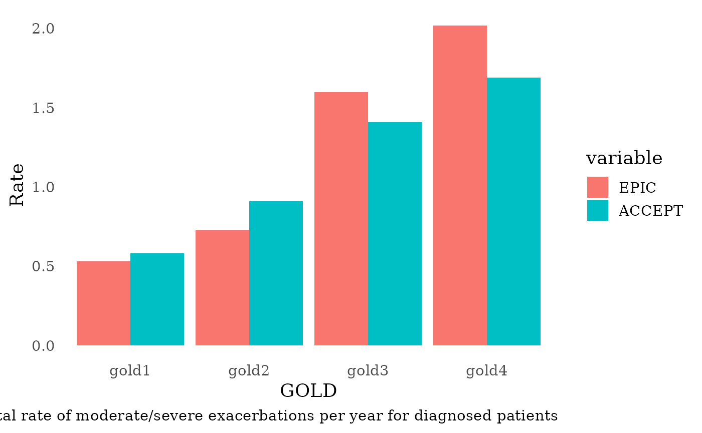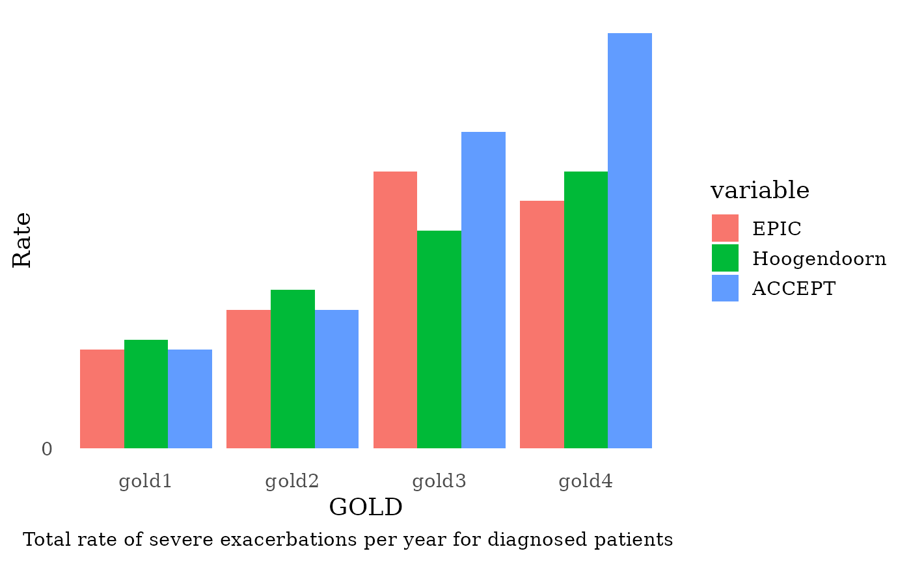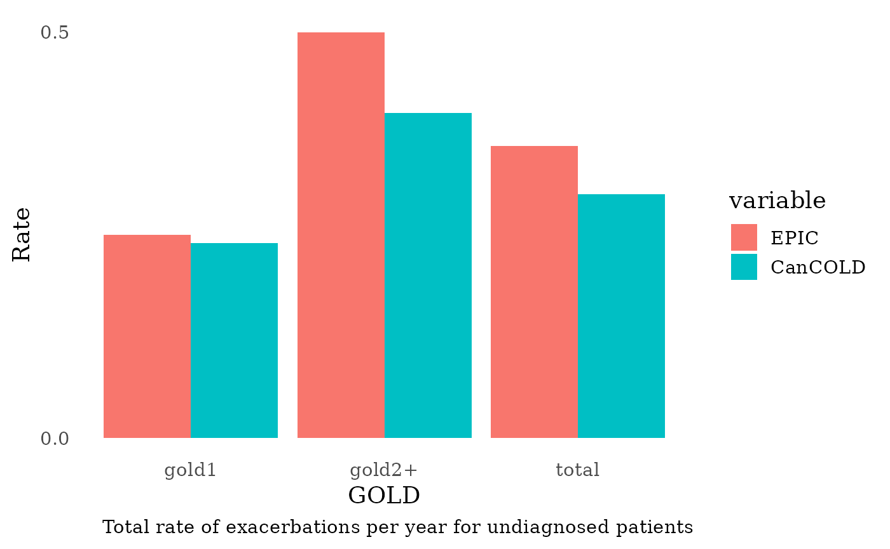

    #> Total rate of exacerbation in undiagnosed patients (0.30 per year in CanCOLD): 0.36
    #> 
    #> Exacerbation rates (per COPD patient-year) by sex over time:

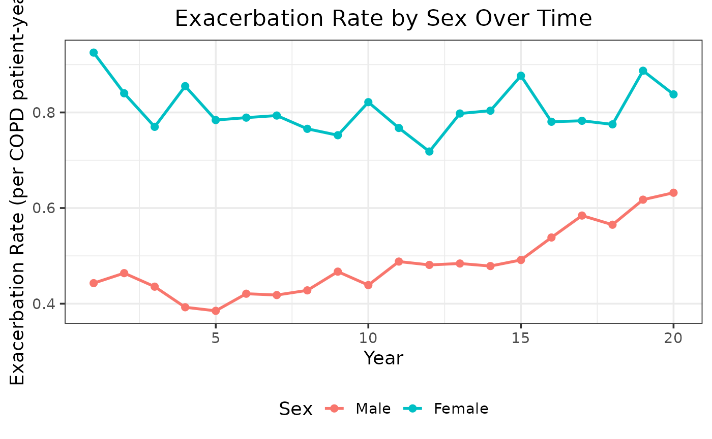

    #> 
    #> Summary statistics:
    #> Total exacerbations (Male): 6566
    #> Total exacerbations (Female): 10781
    #> Total COPD patient-years (Male): 13471
    #> Total COPD patient-years (Female): 13378
    #> Mean exacerbation rate per COPD patient-year (Male): 0.4827
    #> Mean exacerbation rate per COPD patient-year (Female): 0.8062
    #> Overall exacerbation rate per COPD patient-year (Male): 0.4874
    #> Overall exacerbation rate per COPD patient-year (Female): 0.8059

### Recalibration 5:

GOLD2 back a bit again.

``` r
inputs$exacerbation$ln_rate_betas <- t(as.matrix(c(intercept = 1.7, female = 0, age = 0.04082 * 0.1, fev1 = -1.5, smoking_status = 0.5, gold1 = 0.3 , gold2 = -0.3 , gold3 = 0.08 , gold4 = -0.35 , diagnosis_effect = 0)))
validate_exacerbation(1e4, inputs)
#> Initializing the session
#> Working directory: /home/runner/work/epicR/epicR/vignettes
#> Running EPIC model (with custom input parameters)
#> Record mode: record_mode_event (2)
#> Simulating 10000 base agents: 10% 20% 30% 40% 50%
#> 60% 70% 80% 90% 100%
#> Terminating the session
#> Exacerbation Rates per GOLD stages for all patients:
#> exacRateGOLDI   = 0.39
#> exacRateGOLDII  = 0.49
#> exacRateGOLDIII = 1.77
#> exacRateGOLDIV  = 2.04
```

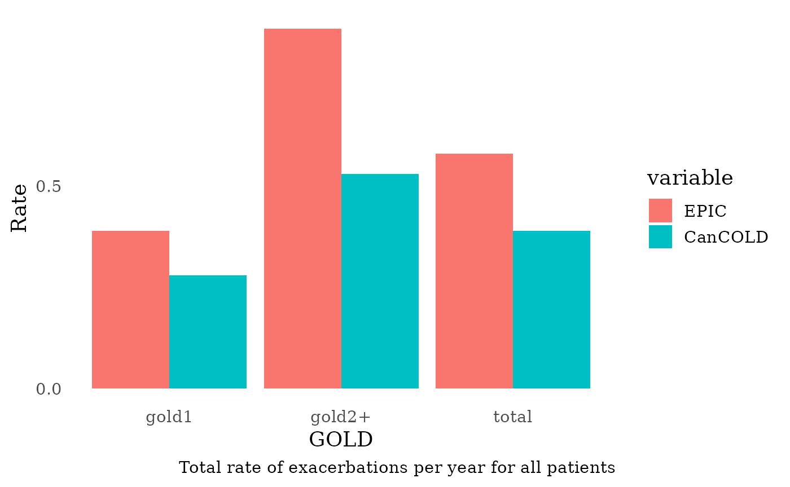

    #> Total rate of exacerbation in all patients (0.39 per year in CanCOLD): 0.58
    #> Is the rate of severe and very severe exacerbations around 477 per CIHI?
    #> Average rate during 20 years: 555.35
    #> Rate in 2017: 448.56

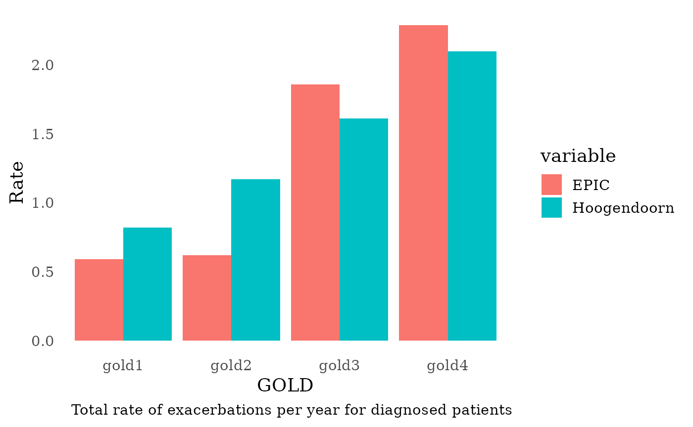

    #> Total rate of exacerbation in diagnosed patients (1.5 per year in Hoogendoorn): 0.84

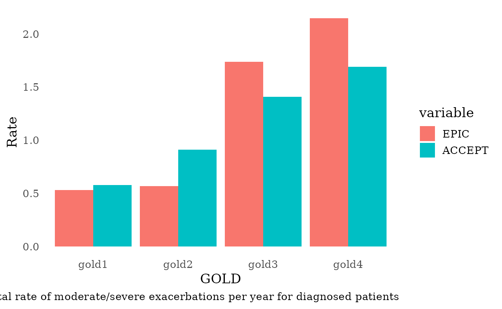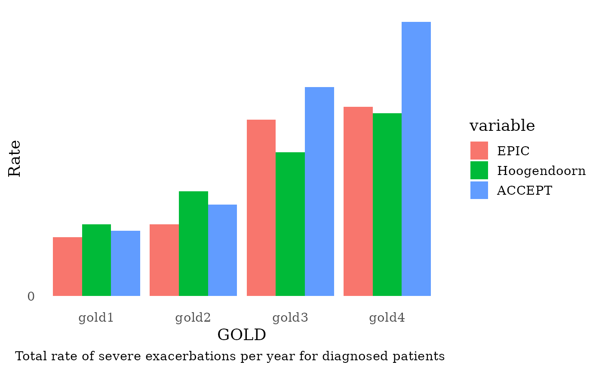

    #> Total rate of exacerbation in undiagnosed patients (0.30 per year in CanCOLD): 0.32
    #> 
    #> Exacerbation rates (per COPD patient-year) by sex over time:

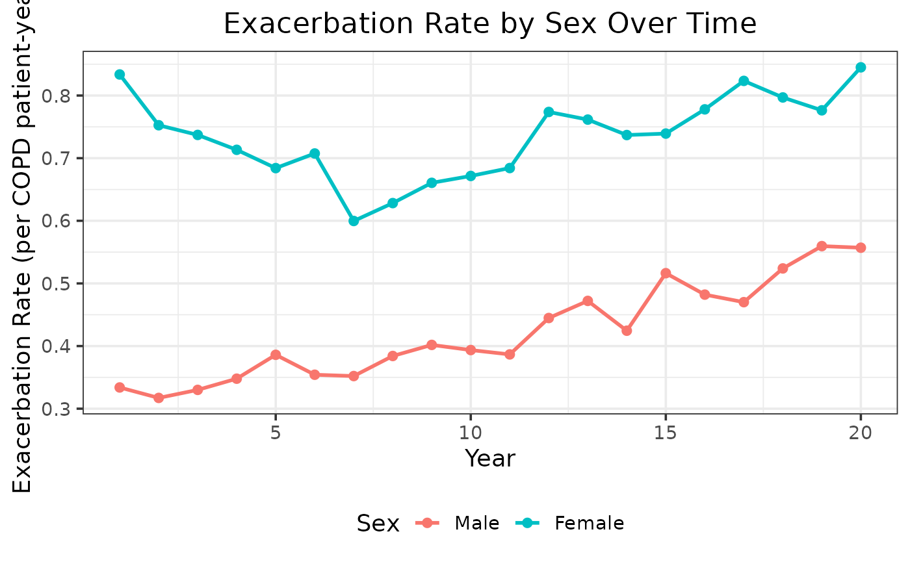

    #> 
    #> Summary statistics:
    #> Total exacerbations (Male): 5690
    #> Total exacerbations (Female): 10132
    #> Total COPD patient-years (Male): 13307
    #> Total COPD patient-years (Female): 13722
    #> Mean exacerbation rate per COPD patient-year (Male): 0.4219
    #> Mean exacerbation rate per COPD patient-year (Female): 0.7352
    #> Overall exacerbation rate per COPD patient-year (Male): 0.4276
    #> Overall exacerbation rate per COPD patient-year (Female): 0.7384

### Recalibration 6:

Reducing intercept and adding to the smoking term.

``` r
inputs$exacerbation$ln_rate_betas <- t(as.matrix(c(intercept = 1.4, female = 0, age = 0.04082 * 0.1, fev1 = -1.5, smoking_status = 0.7, gold1 = 0.3 , gold2 = -0.3 , gold3 = 0.08 , gold4 = -0.35 , diagnosis_effect = 0)))
validate_exacerbation(1e4, inputs)
#> Initializing the session
#> Working directory: /home/runner/work/epicR/epicR/vignettes
#> Running EPIC model (with custom input parameters)
#> Record mode: record_mode_event (2)
#> Simulating 10000 base agents: 10% 20% 30% 40% 50%
#> 60% 70% 80% 90% 100%
#> Terminating the session
#> Exacerbation Rates per GOLD stages for all patients:
#> exacRateGOLDI   = 0.33
#> exacRateGOLDII  = 0.38
#> exacRateGOLDIII = 1.24
#> exacRateGOLDIV  = 1.46
```

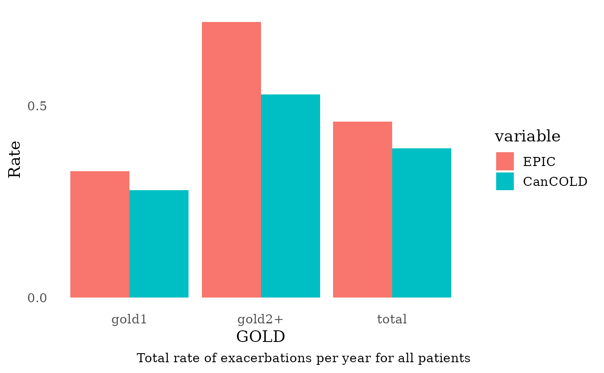

    #> Total rate of exacerbation in all patients (0.39 per year in CanCOLD): 0.46
    #> Is the rate of severe and very severe exacerbations around 477 per CIHI?
    #> Average rate during 20 years: 475.96
    #> Rate in 2017: 487.8

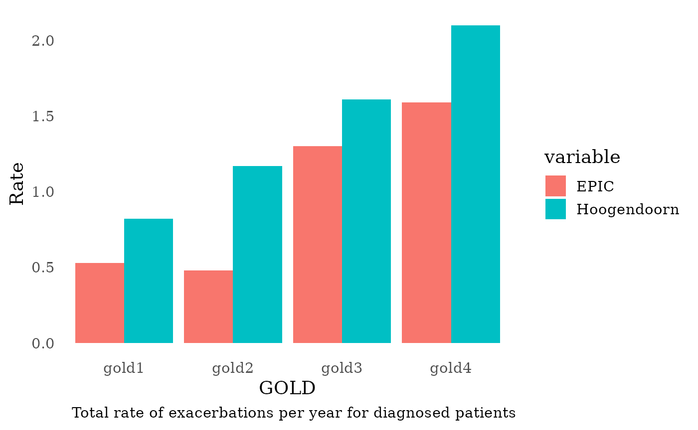

    #> Total rate of exacerbation in diagnosed patients (1.5 per year in Hoogendoorn): 0.69

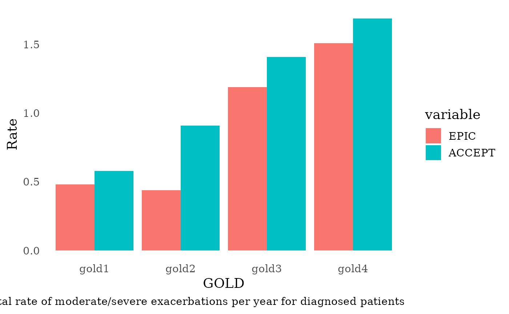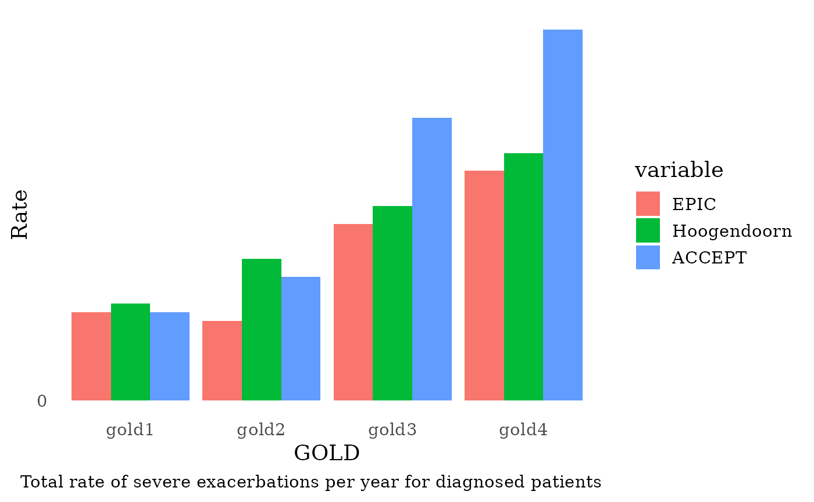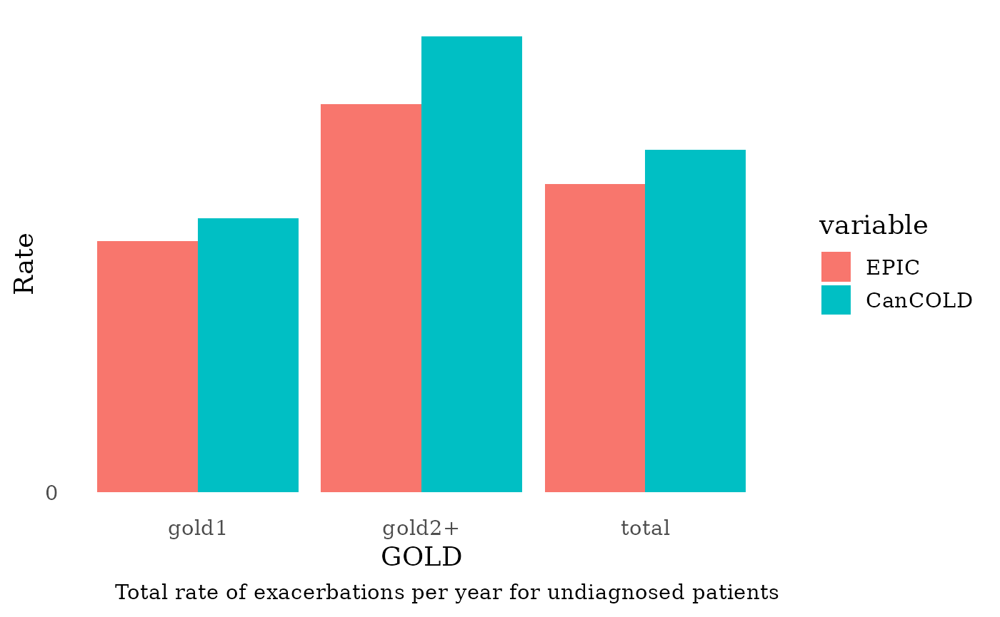

    #> Total rate of exacerbation in undiagnosed patients (0.30 per year in CanCOLD): 0.27
    #> 
    #> Exacerbation rates (per COPD patient-year) by sex over time:

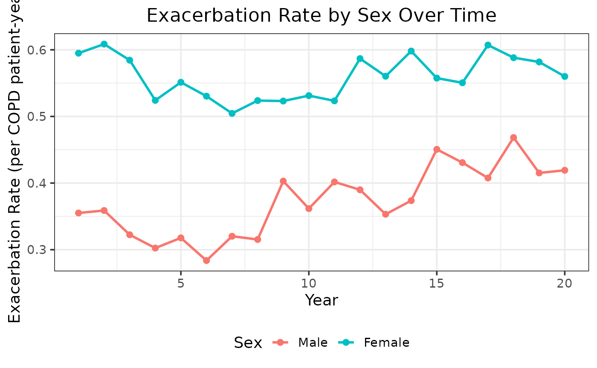

    #> 
    #> Summary statistics:
    #> Total exacerbations (Male): 5204
    #> Total exacerbations (Female): 7866
    #> Total COPD patient-years (Male): 13837
    #> Total COPD patient-years (Female): 14038
    #> Mean exacerbation rate per COPD patient-year (Male): 0.3725
    #> Mean exacerbation rate per COPD patient-year (Female): 0.5595
    #> Overall exacerbation rate per COPD patient-year (Male): 0.3761
    #> Overall exacerbation rate per COPD patient-year (Female): 0.5603
