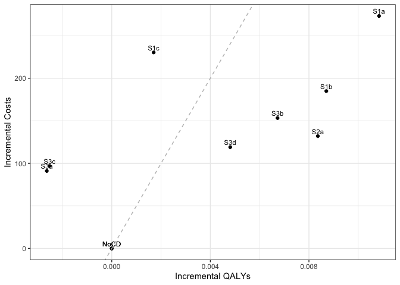

Case Detection Scenario Main Analysis
================
21 February, 2020

    ## Initializing the session

    ## [1] 0

**Global inputs:**

  - Medication adherence is 0.7
  - Smoking adherence is 0.7
  - Cost discounting: 0.015
  - QALY discounting: 0.015
  - Time horizon: 20
  - The WTP threshold for NMB is 50000

**Case detection inputs:**

  - Case detection occurs at 3 year intervals.
  - An outpatient diagnosis costs 61.18
  - The utility gain due to symptom relief from treatment is 0.0367

## S1 All patients scenario

All patients are eligible. The cost of case detection is:

<table>

<thead>

<tr>

<th style="text-align:right;">

None

</th>

<th style="text-align:right;">

CDQ17

</th>

<th style="text-align:right;">

FlowMeter

</th>

<th style="text-align:right;">

FlowMeter\_CDQ

</th>

</tr>

</thead>

<tbody>

<tr>

<td style="text-align:right;">

0

</td>

<td style="text-align:right;">

11.56

</td>

<td style="text-align:right;">

30.46

</td>

<td style="text-align:right;">

42.01

</td>

</tr>

</tbody>

</table>

#### S1NoCD: No Case detection

    ## [1] 0

    ## Terminating the session

    ## [1] 0

#### S1NoCD2: No Case detection- Other time interval

    ## Initializing the session

    ## [1] 0

    ## [1] 0

    ## Terminating the session

    ## [1] 0

#### S1A: CDQ ≥17 points

    ## Initializing the session

    ## [1] 0

    ## [1] 0

    ## Terminating the session

    ## [1] 0

#### S1B: Screening Spirometry with BD

    ## Initializing the session

    ## [1] 0

    ## [1] 0

    ## Terminating the session

    ## [1] 0

#### S1C: CDQ ≥17 points and Screening Spirometry with BD

    ## Initializing the session

    ## [1] 0

    ## [1] 0

    ## Terminating the session

    ## [1] 0

<table>

<thead>

<tr>

<th style="text-align:left;">

Scenario

</th>

<th style="text-align:right;">

Agents

</th>

<th style="text-align:right;">

PatientYears

</th>

<th style="text-align:right;">

CopdPYs

</th>

<th style="text-align:right;">

NCaseDetections

</th>

<th style="text-align:right;">

DiagnosedPYs

</th>

<th style="text-align:right;">

OverdiagnosedPYs

</th>

<th style="text-align:right;">

SABA

</th>

<th style="text-align:right;">

LAMA

</th>

<th style="text-align:right;">

LAMALABA

</th>

<th style="text-align:right;">

ICSLAMALABA

</th>

<th style="text-align:right;">

Mild

</th>

<th style="text-align:right;">

Moderate

</th>

<th style="text-align:right;">

Severe

</th>

<th style="text-align:right;">

VerySevere

</th>

<th style="text-align:right;">

MildPY

</th>

<th style="text-align:right;">

ModeratePY

</th>

<th style="text-align:right;">

SeverePY

</th>

<th style="text-align:right;">

VerySeverePY

</th>

<th style="text-align:right;">

NoCOPD

</th>

<th style="text-align:right;">

GOLD1

</th>

<th style="text-align:right;">

GOLD2

</th>

<th style="text-align:right;">

GOLD3

</th>

<th style="text-align:right;">

GOLD4

</th>

<th style="text-align:right;">

Cost

</th>

<th style="text-align:right;">

CostpAgent

</th>

<th style="text-align:right;">

QALY

</th>

<th style="text-align:right;">

QALYpAgent

</th>

<th style="text-align:right;">

NMB

</th>

<th style="text-align:right;">

IncrementalCosts

</th>

<th style="text-align:right;">

IncrementalQALY

</th>

<th style="text-align:right;">

ICER

</th>

<th style="text-align:right;">

IncrementalNMB

</th>

</tr>

</thead>

<tbody>

<tr>

<td style="text-align:left;">

S1NoCD

</td>

<td style="text-align:right;">

37195539

</td>

<td style="text-align:right;">

625946560

</td>

<td style="text-align:right;">

71206641

</td>

<td style="text-align:right;">

190957851

</td>

<td style="text-align:right;">

13190152

</td>

<td style="text-align:right;">

13384480

</td>

<td style="text-align:right;">

0.017

</td>

<td style="text-align:right;">

0.135

</td>

<td style="text-align:right;">

0.151

</td>

<td style="text-align:right;">

0.080

</td>

<td style="text-align:right;">

15436546

</td>

<td style="text-align:right;">

2885846

</td>

<td style="text-align:right;">

4857447

</td>

<td style="text-align:right;">

418500.0

</td>

<td style="text-align:right;">

0.217

</td>

<td style="text-align:right;">

0.041

</td>

<td style="text-align:right;">

0.068

</td>

<td style="text-align:right;">

0.006

</td>

<td style="text-align:right;">

527334631

</td>

<td style="text-align:right;">

28873208

</td>

<td style="text-align:right;">

30748789

</td>

<td style="text-align:right;">

6899149

</td>

<td style="text-align:right;">

1202023

</td>

<td style="text-align:right;">

79972533446

</td>

<td style="text-align:right;">

2150.057

</td>

<td style="text-align:right;">

466598144

</td>

<td style="text-align:right;">

12.544

</td>

<td style="text-align:right;">

625073.2

</td>

<td style="text-align:right;">

0.000

</td>

<td style="text-align:right;">

0.000

</td>

<td style="text-align:right;">

NaN

</td>

<td style="text-align:right;">

0.000

</td>

</tr>

<tr>

<td style="text-align:left;">

S1NoCD2

</td>

<td style="text-align:right;">

37198963

</td>

<td style="text-align:right;">

626066084

</td>

<td style="text-align:right;">

71127481

</td>

<td style="text-align:right;">

124683962

</td>

<td style="text-align:right;">

13308016

</td>

<td style="text-align:right;">

16324036

</td>

<td style="text-align:right;">

0.021

</td>

<td style="text-align:right;">

0.136

</td>

<td style="text-align:right;">

0.151

</td>

<td style="text-align:right;">

0.080

</td>

<td style="text-align:right;">

15401448

</td>

<td style="text-align:right;">

2881725

</td>

<td style="text-align:right;">

4850527

</td>

<td style="text-align:right;">

418589.0

</td>

<td style="text-align:right;">

0.217

</td>

<td style="text-align:right;">

0.041

</td>

<td style="text-align:right;">

0.068

</td>

<td style="text-align:right;">

0.006

</td>

<td style="text-align:right;">

527526200

</td>

<td style="text-align:right;">

28835415

</td>

<td style="text-align:right;">

30720742

</td>

<td style="text-align:right;">

6895543

</td>

<td style="text-align:right;">

1196229

</td>

<td style="text-align:right;">

80020147890

</td>

<td style="text-align:right;">

2151.139

</td>

<td style="text-align:right;">

466695513

</td>

<td style="text-align:right;">

12.546

</td>

<td style="text-align:right;">

625145.3

</td>

<td style="text-align:right;">

0.000

</td>

<td style="text-align:right;">

0.000

</td>

<td style="text-align:right;">

NaN

</td>

<td style="text-align:right;">

0.000

</td>

</tr>

<tr>

<td style="text-align:left;">

S1NoCDAvg

</td>

<td style="text-align:right;">

37197251

</td>

<td style="text-align:right;">

626006322

</td>

<td style="text-align:right;">

71167061

</td>

<td style="text-align:right;">

157820906

</td>

<td style="text-align:right;">

13249084

</td>

<td style="text-align:right;">

14854258

</td>

<td style="text-align:right;">

0.019

</td>

<td style="text-align:right;">

0.135

</td>

<td style="text-align:right;">

0.151

</td>

<td style="text-align:right;">

0.080

</td>

<td style="text-align:right;">

15418997

</td>

<td style="text-align:right;">

2883786

</td>

<td style="text-align:right;">

4853987

</td>

<td style="text-align:right;">

418544.5

</td>

<td style="text-align:right;">

0.217

</td>

<td style="text-align:right;">

0.041

</td>

<td style="text-align:right;">

0.068

</td>

<td style="text-align:right;">

0.006

</td>

<td style="text-align:right;">

527430416

</td>

<td style="text-align:right;">

28854312

</td>

<td style="text-align:right;">

30734766

</td>

<td style="text-align:right;">

6897346

</td>

<td style="text-align:right;">

1199126

</td>

<td style="text-align:right;">

79996340668

</td>

<td style="text-align:right;">

2150.598

</td>

<td style="text-align:right;">

466646828

</td>

<td style="text-align:right;">

12.545

</td>

<td style="text-align:right;">

625109.2

</td>

<td style="text-align:right;">

0.000

</td>

<td style="text-align:right;">

0.000

</td>

<td style="text-align:right;">

NaN

</td>

<td style="text-align:right;">

0.000

</td>

</tr>

<tr>

<td style="text-align:left;">

S1a

</td>

<td style="text-align:right;">

37197696

</td>

<td style="text-align:right;">

626160112

</td>

<td style="text-align:right;">

71303325

</td>

<td style="text-align:right;">

186082680

</td>

<td style="text-align:right;">

33125607

</td>

<td style="text-align:right;">

13375292

</td>

<td style="text-align:right;">

0.026

</td>

<td style="text-align:right;">

0.159

</td>

<td style="text-align:right;">

0.310

</td>

<td style="text-align:right;">

0.094

</td>

<td style="text-align:right;">

14919323

</td>

<td style="text-align:right;">

2815715

</td>

<td style="text-align:right;">

4754397

</td>

<td style="text-align:right;">

411996.0

</td>

<td style="text-align:right;">

0.209

</td>

<td style="text-align:right;">

0.039

</td>

<td style="text-align:right;">

0.067

</td>

<td style="text-align:right;">

0.006

</td>

<td style="text-align:right;">

527449092

</td>

<td style="text-align:right;">

28880355

</td>

<td style="text-align:right;">

30792049

</td>

<td style="text-align:right;">

6934438

</td>

<td style="text-align:right;">

1207820

</td>

<td style="text-align:right;">

90742666667

</td>

<td style="text-align:right;">

2439.470

</td>

<td style="text-align:right;">

467198836

</td>

<td style="text-align:right;">

12.560

</td>

<td style="text-align:right;">

625554.8

</td>

<td style="text-align:right;">

289.413

</td>

<td style="text-align:right;">

0.015

</td>

<td style="text-align:right;">

18767.20

</td>

<td style="text-align:right;">

481.648

</td>

</tr>

<tr>

<td style="text-align:left;">

S1b

</td>

<td style="text-align:right;">

37191151

</td>

<td style="text-align:right;">

625926088

</td>

<td style="text-align:right;">

71230009

</td>

<td style="text-align:right;">

188343445

</td>

<td style="text-align:right;">

23824950

</td>

<td style="text-align:right;">

13378568

</td>

<td style="text-align:right;">

0.022

</td>

<td style="text-align:right;">

0.148

</td>

<td style="text-align:right;">

0.241

</td>

<td style="text-align:right;">

0.088

</td>

<td style="text-align:right;">

15096496

</td>

<td style="text-align:right;">

2843753

</td>

<td style="text-align:right;">

4802955

</td>

<td style="text-align:right;">

416372.0

</td>

<td style="text-align:right;">

0.212

</td>

<td style="text-align:right;">

0.040

</td>

<td style="text-align:right;">

0.067

</td>

<td style="text-align:right;">

0.006

</td>

<td style="text-align:right;">

527296670

</td>

<td style="text-align:right;">

28858127

</td>

<td style="text-align:right;">

30764062

</td>

<td style="text-align:right;">

6920184

</td>

<td style="text-align:right;">

1201338

</td>

<td style="text-align:right;">

87958045385

</td>

<td style="text-align:right;">

2365.026

</td>

<td style="text-align:right;">

466826928

</td>

<td style="text-align:right;">

12.552

</td>

<td style="text-align:right;">

625239.8

</td>

<td style="text-align:right;">

214.969

</td>

<td style="text-align:right;">

0.008

</td>

<td style="text-align:right;">

28168.26

</td>

<td style="text-align:right;">

166.611

</td>

</tr>

<tr>

<td style="text-align:left;">

S1c

</td>

<td style="text-align:right;">

37198138

</td>

<td style="text-align:right;">

626072244

</td>

<td style="text-align:right;">

71226098

</td>

<td style="text-align:right;">

189207167

</td>

<td style="text-align:right;">

20542021

</td>

<td style="text-align:right;">

13370845

</td>

<td style="text-align:right;">

0.020

</td>

<td style="text-align:right;">

0.144

</td>

<td style="text-align:right;">

0.214

</td>

<td style="text-align:right;">

0.085

</td>

<td style="text-align:right;">

15202120

</td>

<td style="text-align:right;">

2848542

</td>

<td style="text-align:right;">

4810955

</td>

<td style="text-align:right;">

416044.0

</td>

<td style="text-align:right;">

0.213

</td>

<td style="text-align:right;">

0.040

</td>

<td style="text-align:right;">

0.068

</td>

<td style="text-align:right;">

0.006

</td>

<td style="text-align:right;">

527440173

</td>

<td style="text-align:right;">

28871629

</td>

<td style="text-align:right;">

30751320

</td>

<td style="text-align:right;">

6919298

</td>

<td style="text-align:right;">

1198605

</td>

<td style="text-align:right;">

88752748122

</td>

<td style="text-align:right;">

2385.946

</td>

<td style="text-align:right;">

466862994

</td>

<td style="text-align:right;">

12.551

</td>

<td style="text-align:right;">

625149.5

</td>

<td style="text-align:right;">

235.889

</td>

<td style="text-align:right;">

0.006

</td>

<td style="text-align:right;">

37781.57

</td>

<td style="text-align:right;">

76.286

</td>

</tr>

</tbody>

</table>

*Treatment rate:* SABA is expressed per all patient-years, LAMA,
LAMA/LABA, ICS/LAMA/LABA are per COPD patient-years *Exacerbations:*
Total exacerbations and rate per COPD patient-year: *GOLD Stage:*
Cumulative patient-years *Cost/QALY:* Total cost and QALYs *NMB:* Net
Monetary Benefit is calculated as QALY per patient-year \* Lamba - Cost
per patient-year

-----

## S2 Symptomatic patients scenario

Patients with symptoms at year 1 are eligible. The cost of case
detection is:

    ## Initializing the session

    ## [1] 0

<table>

<thead>

<tr>

<th style="text-align:right;">

None

</th>

<th style="text-align:right;">

FlowMeter

</th>

</tr>

</thead>

<tbody>

<tr>

<td style="text-align:right;">

0

</td>

<td style="text-align:right;">

24.33

</td>

</tr>

</tbody>

</table>

#### S2NoCD: No Case detection

    ## [1] 0

    ## Terminating the session

    ## [1] 0

#### S2a: Screening Spirometry without BD

    ## Initializing the session

    ## [1] 0

    ## [1] 0

    ## Terminating the session

    ## [1] 0

<table>

<thead>

<tr>

<th style="text-align:left;">

Scenario

</th>

<th style="text-align:right;">

Agents

</th>

<th style="text-align:right;">

PatientYears

</th>

<th style="text-align:right;">

CopdPYs

</th>

<th style="text-align:right;">

NCaseDetections

</th>

<th style="text-align:right;">

DiagnosedPYs

</th>

<th style="text-align:right;">

OverdiagnosedPYs

</th>

<th style="text-align:right;">

SABA

</th>

<th style="text-align:right;">

LAMA

</th>

<th style="text-align:right;">

LAMALABA

</th>

<th style="text-align:right;">

ICSLAMALABA

</th>

<th style="text-align:right;">

Mild

</th>

<th style="text-align:right;">

Moderate

</th>

<th style="text-align:right;">

Severe

</th>

<th style="text-align:right;">

VerySevere

</th>

<th style="text-align:right;">

MildPY

</th>

<th style="text-align:right;">

ModeratePY

</th>

<th style="text-align:right;">

SeverePY

</th>

<th style="text-align:right;">

VerySeverePY

</th>

<th style="text-align:right;">

NoCOPD

</th>

<th style="text-align:right;">

GOLD1

</th>

<th style="text-align:right;">

GOLD2

</th>

<th style="text-align:right;">

GOLD3

</th>

<th style="text-align:right;">

GOLD4

</th>

<th style="text-align:right;">

Cost

</th>

<th style="text-align:right;">

CostpAgent

</th>

<th style="text-align:right;">

QALY

</th>

<th style="text-align:right;">

QALYpAgent

</th>

<th style="text-align:right;">

NMB

</th>

<th style="text-align:right;">

IncrementalCosts

</th>

<th style="text-align:right;">

IncrementalQALY

</th>

<th style="text-align:right;">

ICER

</th>

<th style="text-align:right;">

IncrementalNMB

</th>

</tr>

</thead>

<tbody>

<tr>

<td style="text-align:left;">

S2NoCD

</td>

<td style="text-align:right;">

22087367

</td>

<td style="text-align:right;">

364709544

</td>

<td style="text-align:right;">

50210805

</td>

<td style="text-align:right;">

111014674

</td>

<td style="text-align:right;">

9692961

</td>

<td style="text-align:right;">

7741774

</td>

<td style="text-align:right;">

0.017

</td>

<td style="text-align:right;">

0.142

</td>

<td style="text-align:right;">

0.160

</td>

<td style="text-align:right;">

0.087

</td>

<td style="text-align:right;">

11449843

</td>

<td style="text-align:right;">

2125276

</td>

<td style="text-align:right;">

3551172

</td>

<td style="text-align:right;">

304757

</td>

<td style="text-align:right;">

0.228

</td>

<td style="text-align:right;">

0.042

</td>

<td style="text-align:right;">

0.071

</td>

<td style="text-align:right;">

0.006

</td>

<td style="text-align:right;">

298927883

</td>

<td style="text-align:right;">

18652285

</td>

<td style="text-align:right;">

22517714

</td>

<td style="text-align:right;">

5547875

</td>

<td style="text-align:right;">

1029476

</td>

<td style="text-align:right;">

58833747414

</td>

<td style="text-align:right;">

2663.683

</td>

<td style="text-align:right;">

271053001

</td>

<td style="text-align:right;">

12.272

</td>

<td style="text-align:right;">

610929.1

</td>

<td style="text-align:right;">

0.000

</td>

<td style="text-align:right;">

0.000

</td>

<td style="text-align:right;">

NaN

</td>

<td style="text-align:right;">

0.000

</td>

</tr>

<tr>

<td style="text-align:left;">

S2a

</td>

<td style="text-align:right;">

22077499

</td>

<td style="text-align:right;">

364591951

</td>

<td style="text-align:right;">

50272883

</td>

<td style="text-align:right;">

108786808

</td>

<td style="text-align:right;">

18520292

</td>

<td style="text-align:right;">

7733001

</td>

<td style="text-align:right;">

0.023

</td>

<td style="text-align:right;">

0.157

</td>

<td style="text-align:right;">

0.269

</td>

<td style="text-align:right;">

0.097

</td>

<td style="text-align:right;">

11199374

</td>

<td style="text-align:right;">

2094406

</td>

<td style="text-align:right;">

3504124

</td>

<td style="text-align:right;">

302378

</td>

<td style="text-align:right;">

0.223

</td>

<td style="text-align:right;">

0.042

</td>

<td style="text-align:right;">

0.070

</td>

<td style="text-align:right;">

0.006

</td>

<td style="text-align:right;">

298753959

</td>

<td style="text-align:right;">

18655783

</td>

<td style="text-align:right;">

22544970

</td>

<td style="text-align:right;">

5573730

</td>

<td style="text-align:right;">

1032473

</td>

<td style="text-align:right;">

63905534183

</td>

<td style="text-align:right;">

2894.600

</td>

<td style="text-align:right;">

271165331

</td>

<td style="text-align:right;">

12.282

</td>

<td style="text-align:right;">

611226.9

</td>

<td style="text-align:right;">

230.917

</td>

<td style="text-align:right;">

0.011

</td>

<td style="text-align:right;">

21839.88

</td>

<td style="text-align:right;">

297.742

</td>

</tr>

</tbody>

</table>

*Treatment rate:* SABA is expressed per all patient-years, LAMA,
LAMA/LABA, ICS/LAMA/LABA are per COPD patient-years *Exacerbations:*
Total exacerbations and rate per COPD patient-year: *GOLD Stage:*
Cumulative patient-years *Cost/QALY:* Total cost and QALYs *NMB:* Net
Monetary Benefit is calculated as QALY per patient-year \* Lamba - Cost
per patient-year

-----

## S3 Smoking history scenario

Ever smokers ≥50 years of age are eligible. The cost of case detection
is:

    ## Initializing the session

    ## [1] 0

<table>

<thead>

<tr>

<th style="text-align:right;">

None

</th>

<th style="text-align:right;">

CDQ195

</th>

<th style="text-align:right;">

CDQ165

</th>

<th style="text-align:right;">

FlowMeter

</th>

<th style="text-align:right;">

FlowMeter\_CDQ

</th>

</tr>

</thead>

<tbody>

<tr>

<td style="text-align:right;">

0

</td>

<td style="text-align:right;">

11.56

</td>

<td style="text-align:right;">

11.56

</td>

<td style="text-align:right;">

24.33

</td>

<td style="text-align:right;">

42.01

</td>

</tr>

</tbody>

</table>

#### S3NoCD: No Case detection

    ## [1] 0

    ## Terminating the session

    ## [1] 0

#### S3a: CDQ ≥19.5 points

    ## Initializing the session

    ## [1] 0

    ## [1] 0

    ## Terminating the session

    ## [1] 0

#### S3b: CDQ ≥16.5 points

    ## Initializing the session

    ## [1] 0

    ## [1] 0

    ## Terminating the session

    ## [1] 0

#### S3c: Screening spirometry without BD

    ## Initializing the session

    ## [1] 0

    ## [1] 0

    ## Terminating the session

    ## [1] 0

#### S3d: Screening Spirometry with BD + CDQ ≥17 points

    ## Initializing the session

    ## [1] 0

    ## [1] 0

    ## Terminating the session

    ## [1] 0

<table>

<thead>

<tr>

<th style="text-align:left;">

Scenario

</th>

<th style="text-align:right;">

Agents

</th>

<th style="text-align:right;">

PatientYears

</th>

<th style="text-align:right;">

CopdPYs

</th>

<th style="text-align:right;">

NCaseDetections

</th>

<th style="text-align:right;">

DiagnosedPYs

</th>

<th style="text-align:right;">

OverdiagnosedPYs

</th>

<th style="text-align:right;">

SABA

</th>

<th style="text-align:right;">

LAMA

</th>

<th style="text-align:right;">

LAMALABA

</th>

<th style="text-align:right;">

ICSLAMALABA

</th>

<th style="text-align:right;">

Mild

</th>

<th style="text-align:right;">

Moderate

</th>

<th style="text-align:right;">

Severe

</th>

<th style="text-align:right;">

VerySevere

</th>

<th style="text-align:right;">

MildPY

</th>

<th style="text-align:right;">

ModeratePY

</th>

<th style="text-align:right;">

SeverePY

</th>

<th style="text-align:right;">

VerySeverePY

</th>

<th style="text-align:right;">

NoCOPD

</th>

<th style="text-align:right;">

GOLD1

</th>

<th style="text-align:right;">

GOLD2

</th>

<th style="text-align:right;">

GOLD3

</th>

<th style="text-align:right;">

GOLD4

</th>

<th style="text-align:right;">

Cost

</th>

<th style="text-align:right;">

CostpAgent

</th>

<th style="text-align:right;">

QALY

</th>

<th style="text-align:right;">

QALYpAgent

</th>

<th style="text-align:right;">

NMB

</th>

<th style="text-align:right;">

IncrementalCosts

</th>

<th style="text-align:right;">

IncrementalQALY

</th>

<th style="text-align:right;">

ICER

</th>

<th style="text-align:right;">

IncrementalNMB

</th>

</tr>

</thead>

<tbody>

<tr>

<td style="text-align:left;">

S3NoCD

</td>

<td style="text-align:right;">

17250801

</td>

<td style="text-align:right;">

260119397

</td>

<td style="text-align:right;">

41739012

</td>

<td style="text-align:right;">

80092350

</td>

<td style="text-align:right;">

7815945

</td>

<td style="text-align:right;">

5811431

</td>

<td style="text-align:right;">

0.018

</td>

<td style="text-align:right;">

0.137

</td>

<td style="text-align:right;">

0.154

</td>

<td style="text-align:right;">

0.086

</td>

<td style="text-align:right;">

9758568

</td>

<td style="text-align:right;">

1814113

</td>

<td style="text-align:right;">

3039504

</td>

<td style="text-align:right;">

260755

</td>

<td style="text-align:right;">

0.234

</td>

<td style="text-align:right;">

0.043

</td>

<td style="text-align:right;">

0.073

</td>

<td style="text-align:right;">

0.006

</td>

<td style="text-align:right;">

207484559

</td>

<td style="text-align:right;">

15304628

</td>

<td style="text-align:right;">

18714911

</td>

<td style="text-align:right;">

4811565

</td>

<td style="text-align:right;">

894372

</td>

<td style="text-align:right;">

49945027393

</td>

<td style="text-align:right;">

2895.229

</td>

<td style="text-align:right;">

193749776

</td>

<td style="text-align:right;">

11.231

</td>

<td style="text-align:right;">

558672.2

</td>

<td style="text-align:right;">

0.000

</td>

<td style="text-align:right;">

0.000

</td>

<td style="text-align:right;">

NaN

</td>

<td style="text-align:right;">

0.000

</td>

</tr>

<tr>

<td style="text-align:left;">

S3a

</td>

<td style="text-align:right;">

17248698

</td>

<td style="text-align:right;">

260103073

</td>

<td style="text-align:right;">

41733096

</td>

<td style="text-align:right;">

79305564

</td>

<td style="text-align:right;">

10999299

</td>

<td style="text-align:right;">

5816009

</td>

<td style="text-align:right;">

0.021

</td>

<td style="text-align:right;">

0.143

</td>

<td style="text-align:right;">

0.204

</td>

<td style="text-align:right;">

0.091

</td>

<td style="text-align:right;">

9633605

</td>

<td style="text-align:right;">

1804838

</td>

<td style="text-align:right;">

3018352

</td>

<td style="text-align:right;">

260021

</td>

<td style="text-align:right;">

0.231

</td>

<td style="text-align:right;">

0.043

</td>

<td style="text-align:right;">

0.072

</td>

<td style="text-align:right;">

0.006

</td>

<td style="text-align:right;">

207476086

</td>

<td style="text-align:right;">

15295375

</td>

<td style="text-align:right;">

18717376

</td>

<td style="text-align:right;">

4811511

</td>

<td style="text-align:right;">

895684

</td>

<td style="text-align:right;">

52978525579

</td>

<td style="text-align:right;">

3071.451

</td>

<td style="text-align:right;">

193815173

</td>

<td style="text-align:right;">

11.237

</td>

<td style="text-align:right;">

558754.1

</td>

<td style="text-align:right;">

176.221

</td>

<td style="text-align:right;">

0.005

</td>

<td style="text-align:right;">

34146.23

</td>

<td style="text-align:right;">

81.818

</td>

</tr>

<tr>

<td style="text-align:left;">

S3b

</td>

<td style="text-align:right;">

17242631

</td>

<td style="text-align:right;">

260065673

</td>

<td style="text-align:right;">

41792781

</td>

<td style="text-align:right;">

77759943

</td>

<td style="text-align:right;">

17187079

</td>

<td style="text-align:right;">

5810534

</td>

<td style="text-align:right;">

0.027

</td>

<td style="text-align:right;">

0.156

</td>

<td style="text-align:right;">

0.293

</td>

<td style="text-align:right;">

0.099

</td>

<td style="text-align:right;">

9489031

</td>

<td style="text-align:right;">

1778241

</td>

<td style="text-align:right;">

2986590

</td>

<td style="text-align:right;">

257680

</td>

<td style="text-align:right;">

0.227

</td>

<td style="text-align:right;">

0.043

</td>

<td style="text-align:right;">

0.071

</td>

<td style="text-align:right;">

0.006

</td>

<td style="text-align:right;">

207383951

</td>

<td style="text-align:right;">

15315393

</td>

<td style="text-align:right;">

18723683

</td>

<td style="text-align:right;">

4829033

</td>

<td style="text-align:right;">

908112

</td>

<td style="text-align:right;">

55095325299

</td>

<td style="text-align:right;">

3195.297

</td>

<td style="text-align:right;">

193922329

</td>

<td style="text-align:right;">

11.247

</td>

<td style="text-align:right;">

559138.6

</td>

<td style="text-align:right;">

300.067

</td>

<td style="text-align:right;">

0.015

</td>

<td style="text-align:right;">

19575.13

</td>

<td style="text-align:right;">

466.383

</td>

</tr>

<tr>

<td style="text-align:left;">

S3c

</td>

<td style="text-align:right;">

17248002

</td>

<td style="text-align:right;">

260125323

</td>

<td style="text-align:right;">

41763852

</td>

<td style="text-align:right;">

78553114

</td>

<td style="text-align:right;">

14078935

</td>

<td style="text-align:right;">

5816574

</td>

<td style="text-align:right;">

0.024

</td>

<td style="text-align:right;">

0.150

</td>

<td style="text-align:right;">

0.250

</td>

<td style="text-align:right;">

0.095

</td>

<td style="text-align:right;">

9564252

</td>

<td style="text-align:right;">

1791577

</td>

<td style="text-align:right;">

3007745

</td>

<td style="text-align:right;">

258805

</td>

<td style="text-align:right;">

0.229

</td>

<td style="text-align:right;">

0.043

</td>

<td style="text-align:right;">

0.072

</td>

<td style="text-align:right;">

0.006

</td>

<td style="text-align:right;">

207467571

</td>

<td style="text-align:right;">

15302696

</td>

<td style="text-align:right;">

18722817

</td>

<td style="text-align:right;">

4821640

</td>

<td style="text-align:right;">

901656

</td>

<td style="text-align:right;">

53824963528

</td>

<td style="text-align:right;">

3120.649

</td>

<td style="text-align:right;">

193899120

</td>

<td style="text-align:right;">

11.242

</td>

<td style="text-align:right;">

558970.9

</td>

<td style="text-align:right;">

225.420

</td>

<td style="text-align:right;">

0.010

</td>

<td style="text-align:right;">

21507.02

</td>

<td style="text-align:right;">

298.641

</td>

</tr>

<tr>

<td style="text-align:left;">

S3d

</td>

<td style="text-align:right;">

17258354

</td>

<td style="text-align:right;">

260339842

</td>

<td style="text-align:right;">

41790787

</td>

<td style="text-align:right;">

78973259

</td>

<td style="text-align:right;">

12673391

</td>

<td style="text-align:right;">

5816407

</td>

<td style="text-align:right;">

0.023

</td>

<td style="text-align:right;">

0.147

</td>

<td style="text-align:right;">

0.228

</td>

<td style="text-align:right;">

0.093

</td>

<td style="text-align:right;">

9609495

</td>

<td style="text-align:right;">

1796427

</td>

<td style="text-align:right;">

3009498

</td>

<td style="text-align:right;">

258615

</td>

<td style="text-align:right;">

0.230

</td>

<td style="text-align:right;">

0.043

</td>

<td style="text-align:right;">

0.072

</td>

<td style="text-align:right;">

0.006

</td>

<td style="text-align:right;">

207647458

</td>

<td style="text-align:right;">

15325224

</td>

<td style="text-align:right;">

18725240

</td>

<td style="text-align:right;">

4825222

</td>

<td style="text-align:right;">

899169

</td>

<td style="text-align:right;">

54047585836

</td>

<td style="text-align:right;">

3131.677

</td>

<td style="text-align:right;">

194027487

</td>

<td style="text-align:right;">

11.243

</td>

<td style="text-align:right;">

558994.6

</td>

<td style="text-align:right;">

236.447

</td>

<td style="text-align:right;">

0.011

</td>

<td style="text-align:right;">

21156.57

</td>

<td style="text-align:right;">

322.356

</td>

</tr>

</tbody>

</table>

*Treatment rate:* SABA is expressed per all patient-years, LAMA,
LAMA/LABA, ICS/LAMA/LABA are per COPD patient-years *Exacerbations:*
Total exacerbations and rate per COPD patient-year *GOLD Stage:*
Cumulative patient-years *Cost/QALY:* Total cost and QALYs *NMB:* Net
Monetary Benefit is calculated as QALY per patient-year \* Lamba - Cost
per patient-year

-----

## All Scenarios

*Ordered by descending Net Monetary Benefit*

<table>

<thead>

<tr>

<th style="text-align:left;">

Scenario

</th>

<th style="text-align:right;">

Agents

</th>

<th style="text-align:right;">

Cost

</th>

<th style="text-align:right;">

CostpAgent

</th>

<th style="text-align:right;">

QALY

</th>

<th style="text-align:right;">

QALYpAgent

</th>

<th style="text-align:right;">

ICER

</th>

<th style="text-align:right;">

IncrementalNMB

</th>

</tr>

</thead>

<tbody>

<tr>

<td style="text-align:left;">

S1a

</td>

<td style="text-align:right;">

37197696

</td>

<td style="text-align:right;">

90742666667

</td>

<td style="text-align:right;">

2439.470

</td>

<td style="text-align:right;">

467198836

</td>

<td style="text-align:right;">

12.560

</td>

<td style="text-align:right;">

18767.20

</td>

<td style="text-align:right;">

481.648

</td>

</tr>

<tr>

<td style="text-align:left;">

S3b

</td>

<td style="text-align:right;">

17242631

</td>

<td style="text-align:right;">

55095325299

</td>

<td style="text-align:right;">

3195.297

</td>

<td style="text-align:right;">

193922329

</td>

<td style="text-align:right;">

11.247

</td>

<td style="text-align:right;">

19575.13

</td>

<td style="text-align:right;">

466.383

</td>

</tr>

<tr>

<td style="text-align:left;">

S3d

</td>

<td style="text-align:right;">

17258354

</td>

<td style="text-align:right;">

54047585836

</td>

<td style="text-align:right;">

3131.677

</td>

<td style="text-align:right;">

194027487

</td>

<td style="text-align:right;">

11.243

</td>

<td style="text-align:right;">

21156.57

</td>

<td style="text-align:right;">

322.356

</td>

</tr>

<tr>

<td style="text-align:left;">

S3c

</td>

<td style="text-align:right;">

17248002

</td>

<td style="text-align:right;">

53824963528

</td>

<td style="text-align:right;">

3120.649

</td>

<td style="text-align:right;">

193899120

</td>

<td style="text-align:right;">

11.242

</td>

<td style="text-align:right;">

21507.02

</td>

<td style="text-align:right;">

298.641

</td>

</tr>

<tr>

<td style="text-align:left;">

S2a

</td>

<td style="text-align:right;">

22077499

</td>

<td style="text-align:right;">

63905534183

</td>

<td style="text-align:right;">

2894.600

</td>

<td style="text-align:right;">

271165331

</td>

<td style="text-align:right;">

12.282

</td>

<td style="text-align:right;">

21839.88

</td>

<td style="text-align:right;">

297.742

</td>

</tr>

<tr>

<td style="text-align:left;">

S1b

</td>

<td style="text-align:right;">

37191151

</td>

<td style="text-align:right;">

87958045385

</td>

<td style="text-align:right;">

2365.026

</td>

<td style="text-align:right;">

466826928

</td>

<td style="text-align:right;">

12.552

</td>

<td style="text-align:right;">

28168.26

</td>

<td style="text-align:right;">

166.611

</td>

</tr>

<tr>

<td style="text-align:left;">

S3a

</td>

<td style="text-align:right;">

17248698

</td>

<td style="text-align:right;">

52978525579

</td>

<td style="text-align:right;">

3071.451

</td>

<td style="text-align:right;">

193815173

</td>

<td style="text-align:right;">

11.237

</td>

<td style="text-align:right;">

34146.23

</td>

<td style="text-align:right;">

81.818

</td>

</tr>

<tr>

<td style="text-align:left;">

S1c

</td>

<td style="text-align:right;">

37198138

</td>

<td style="text-align:right;">

88752748122

</td>

<td style="text-align:right;">

2385.946

</td>

<td style="text-align:right;">

466862994

</td>

<td style="text-align:right;">

12.551

</td>

<td style="text-align:right;">

37781.57

</td>

<td style="text-align:right;">

76.286

</td>

</tr>

<tr>

<td style="text-align:left;">

S1NoCD

</td>

<td style="text-align:right;">

37195539

</td>

<td style="text-align:right;">

79972533446

</td>

<td style="text-align:right;">

2150.057

</td>

<td style="text-align:right;">

466598144

</td>

<td style="text-align:right;">

12.544

</td>

<td style="text-align:right;">

NaN

</td>

<td style="text-align:right;">

0.000

</td>

</tr>

<tr>

<td style="text-align:left;">

S2NoCD

</td>

<td style="text-align:right;">

22087367

</td>

<td style="text-align:right;">

58833747414

</td>

<td style="text-align:right;">

2663.683

</td>

<td style="text-align:right;">

271053001

</td>

<td style="text-align:right;">

12.272

</td>

<td style="text-align:right;">

NaN

</td>

<td style="text-align:right;">

0.000

</td>

</tr>

<tr>

<td style="text-align:left;">

S3NoCD

</td>

<td style="text-align:right;">

17250801

</td>

<td style="text-align:right;">

49945027393

</td>

<td style="text-align:right;">

2895.229

</td>

<td style="text-align:right;">

193749776

</td>

<td style="text-align:right;">

11.231

</td>

<td style="text-align:right;">

NaN

</td>

<td style="text-align:right;">

0.000

</td>

</tr>

</tbody>

</table>

-----

## Cost Effectiveness Plane

Adjusted to the total population

<table>

<thead>

<tr>

<th style="text-align:left;">

Scenario

</th>

<th style="text-align:right;">

Agents

</th>

<th style="text-align:right;">

PropAgents

</th>

<th style="text-align:right;">

Cost

</th>

<th style="text-align:right;">

CostpAgent

</th>

<th style="text-align:right;">

CostpAgentExcluded

</th>

<th style="text-align:right;">

CostpAgentAll

</th>

<th style="text-align:right;">

QALY

</th>

<th style="text-align:right;">

QALYpAgent

</th>

<th style="text-align:right;">

QALYpAgentExcluded

</th>

<th style="text-align:right;">

QALYpAgentAll

</th>

<th style="text-align:right;">

IncrementalCosts

</th>

<th style="text-align:right;">

IncrementalQALY

</th>

<th style="text-align:right;">

ICERAdj

</th>

<th style="text-align:right;">

ICER

</th>

<th style="text-align:right;">

INMB

</th>

</tr>

</thead>

<tbody>

<tr>

<td style="text-align:left;">

S1NoCDAvg

</td>

<td style="text-align:right;">

37197251

</td>

<td style="text-align:right;">

1.0000000

</td>

<td style="text-align:right;">

79996340668

</td>

<td style="text-align:right;">

2150.598

</td>

<td style="text-align:right;">

0.000

</td>

<td style="text-align:right;">

2150.598

</td>

<td style="text-align:right;">

466646828

</td>

<td style="text-align:right;">

12.54520

</td>

<td style="text-align:right;">

0.00000

</td>

<td style="text-align:right;">

12.54520

</td>

<td style="text-align:right;">

0.00000

</td>

<td style="text-align:right;">

0.0000000

</td>

<td style="text-align:right;">

NaN

</td>

<td style="text-align:right;">

NaN

</td>

<td style="text-align:right;">

0.00000

</td>

</tr>

<tr>

<td style="text-align:left;">

S1a

</td>

<td style="text-align:right;">

37197696

</td>

<td style="text-align:right;">

1.0000000

</td>

<td style="text-align:right;">

90742666667

</td>

<td style="text-align:right;">

2439.470

</td>

<td style="text-align:right;">

0.000

</td>

<td style="text-align:right;">

2439.470

</td>

<td style="text-align:right;">

467198836

</td>

<td style="text-align:right;">

12.55989

</td>

<td style="text-align:right;">

0.00000

</td>

<td style="text-align:right;">

12.55989

</td>

<td style="text-align:right;">

288.87190

</td>

<td style="text-align:right;">

0.0146898

</td>

<td style="text-align:right;">

19664.85

</td>

<td style="text-align:right;">

18767.20

</td>

<td style="text-align:right;">

445.61616

</td>

</tr>

<tr>

<td style="text-align:left;">

S1b

</td>

<td style="text-align:right;">

37191151

</td>

<td style="text-align:right;">

1.0000000

</td>

<td style="text-align:right;">

87958045385

</td>

<td style="text-align:right;">

2365.026

</td>

<td style="text-align:right;">

0.000

</td>

<td style="text-align:right;">

2365.026

</td>

<td style="text-align:right;">

466826928

</td>

<td style="text-align:right;">

12.55210

</td>

<td style="text-align:right;">

0.00000

</td>

<td style="text-align:right;">

12.55210

</td>

<td style="text-align:right;">

214.42798

</td>

<td style="text-align:right;">

0.0069002

</td>

<td style="text-align:right;">

31075.82

</td>

<td style="text-align:right;">

28168.26

</td>

<td style="text-align:right;">

130.57981

</td>

</tr>

<tr>

<td style="text-align:left;">

S1c

</td>

<td style="text-align:right;">

37198138

</td>

<td style="text-align:right;">

1.0000000

</td>

<td style="text-align:right;">

88752748122

</td>

<td style="text-align:right;">

2385.946

</td>

<td style="text-align:right;">

0.000

</td>

<td style="text-align:right;">

2385.946

</td>

<td style="text-align:right;">

466862994

</td>

<td style="text-align:right;">

12.55071

</td>

<td style="text-align:right;">

0.00000

</td>

<td style="text-align:right;">

12.55071

</td>

<td style="text-align:right;">

235.34780

</td>

<td style="text-align:right;">

0.0055120

</td>

<td style="text-align:right;">

42697.05

</td>

<td style="text-align:right;">

37781.58

</td>

<td style="text-align:right;">

40.25413

</td>

</tr>

<tr>

<td style="text-align:left;">

S2NoCD

</td>

<td style="text-align:right;">

22087367

</td>

<td style="text-align:right;">

0.5937903

</td>

<td style="text-align:right;">

58833747414

</td>

<td style="text-align:right;">

2663.683

</td>

<td style="text-align:right;">

1400.579

</td>

<td style="text-align:right;">

2150.598

</td>

<td style="text-align:right;">

271053001

</td>

<td style="text-align:right;">

12.27186

</td>

<td style="text-align:right;">

12.94476

</td>

<td style="text-align:right;">

12.54520

</td>

<td style="text-align:right;">

0.00000

</td>

<td style="text-align:right;">

0.0000000

</td>

<td style="text-align:right;">

NaN

</td>

<td style="text-align:right;">

NaN

</td>

<td style="text-align:right;">

0.00000

</td>

</tr>

<tr>

<td style="text-align:left;">

S2a

</td>

<td style="text-align:right;">

22077499

</td>

<td style="text-align:right;">

0.5935250

</td>

<td style="text-align:right;">

63905534183

</td>

<td style="text-align:right;">

2894.600

</td>

<td style="text-align:right;">

1400.579

</td>

<td style="text-align:right;">

2287.318

</td>

<td style="text-align:right;">

271165331

</td>

<td style="text-align:right;">

12.28243

</td>

<td style="text-align:right;">

12.94476

</td>

<td style="text-align:right;">

12.55165

</td>

<td style="text-align:right;">

136.71999

</td>

<td style="text-align:right;">

0.0064540

</td>

<td style="text-align:right;">

21183.88

</td>

<td style="text-align:right;">

21839.88

</td>

<td style="text-align:right;">

185.97823

</td>

</tr>

<tr>

<td style="text-align:left;">

S3NoCD

</td>

<td style="text-align:right;">

17250801

</td>

<td style="text-align:right;">

0.4637655

</td>

<td style="text-align:right;">

49945027393

</td>

<td style="text-align:right;">

2895.229

</td>

<td style="text-align:right;">

1506.600

</td>

<td style="text-align:right;">

2150.598

</td>

<td style="text-align:right;">

193749776

</td>

<td style="text-align:right;">

11.23135

</td>

<td style="text-align:right;">

13.68148

</td>

<td style="text-align:right;">

12.54520

</td>

<td style="text-align:right;">

0.00000

</td>

<td style="text-align:right;">

0.0000000

</td>

<td style="text-align:right;">

NaN

</td>

<td style="text-align:right;">

NaN

</td>

<td style="text-align:right;">

0.00000

</td>

</tr>

<tr>

<td style="text-align:left;">

S3a

</td>

<td style="text-align:right;">

17248698

</td>

<td style="text-align:right;">

0.4637089

</td>

<td style="text-align:right;">

52978525579

</td>

<td style="text-align:right;">

3071.451

</td>

<td style="text-align:right;">

1506.600

</td>

<td style="text-align:right;">

2232.235

</td>

<td style="text-align:right;">

193815173

</td>

<td style="text-align:right;">

11.23651

</td>

<td style="text-align:right;">

13.68148

</td>

<td style="text-align:right;">

12.54773

</td>

<td style="text-align:right;">

81.63685

</td>

<td style="text-align:right;">

0.0025316

</td>

<td style="text-align:right;">

32246.85

</td>

<td style="text-align:right;">

34146.23

</td>

<td style="text-align:right;">

44.94428

</td>

</tr>

<tr>

<td style="text-align:left;">

S3b

</td>

<td style="text-align:right;">

17242631

</td>

<td style="text-align:right;">

0.4635458

</td>

<td style="text-align:right;">

55095325299

</td>

<td style="text-align:right;">

3195.297

</td>

<td style="text-align:right;">

1506.600

</td>

<td style="text-align:right;">

2289.388

</td>

<td style="text-align:right;">

193922329

</td>

<td style="text-align:right;">

11.24668

</td>

<td style="text-align:right;">

13.68148

</td>

<td style="text-align:right;">

12.55284

</td>

<td style="text-align:right;">

138.79001

</td>

<td style="text-align:right;">

0.0076438

</td>

<td style="text-align:right;">

18157.08

</td>

<td style="text-align:right;">

19575.13

</td>

<td style="text-align:right;">

243.40243

</td>

</tr>

<tr>

<td style="text-align:left;">

S3c

</td>

<td style="text-align:right;">

17248002

</td>

<td style="text-align:right;">

0.4636902

</td>

<td style="text-align:right;">

53824963528

</td>

<td style="text-align:right;">

3120.649

</td>

<td style="text-align:right;">

1506.600

</td>

<td style="text-align:right;">

2255.019

</td>

<td style="text-align:right;">

193899120

</td>

<td style="text-align:right;">

11.24183

</td>

<td style="text-align:right;">

13.68148

</td>

<td style="text-align:right;">

12.55024

</td>

<td style="text-align:right;">

104.42043

</td>

<td style="text-align:right;">

0.0050444

</td>

<td style="text-align:right;">

20700.25

</td>

<td style="text-align:right;">

21507.02

</td>

<td style="text-align:right;">

147.79979

</td>

</tr>

<tr>

<td style="text-align:left;">

S3d

</td>

<td style="text-align:right;">

17258354

</td>

<td style="text-align:right;">

0.4639685

</td>

<td style="text-align:right;">

54047585836

</td>

<td style="text-align:right;">

3131.677

</td>

<td style="text-align:right;">

1506.600

</td>

<td style="text-align:right;">

2260.584

</td>

<td style="text-align:right;">

194027487

</td>

<td style="text-align:right;">

11.24253

</td>

<td style="text-align:right;">

13.68148

</td>

<td style="text-align:right;">

12.54988

</td>

<td style="text-align:right;">

109.98606

</td>

<td style="text-align:right;">

0.0046878

</td>

<td style="text-align:right;">

23462.00

</td>

<td style="text-align:right;">

21156.57

</td>

<td style="text-align:right;">

124.40586

</td>

</tr>

</tbody>

</table>

<!-- -->

## Clinical Results for all scenarios

Adjusted to the total population

<table>

<thead>

<tr>

<th style="text-align:left;">

Scenario

</th>

<th style="text-align:right;">

PropAgents

</th>

<th style="text-align:right;">

ProppPatientYears

</th>

<th style="text-align:right;">

ProppCopdPYs

</th>

<th style="text-align:right;">

SABAAll

</th>

<th style="text-align:right;">

LAMAAll

</th>

<th style="text-align:right;">

LAMALABAAll

</th>

<th style="text-align:right;">

ICSLAMALABAAll

</th>

<th style="text-align:right;">

MildpAgentAll

</th>

<th style="text-align:right;">

ModeratepAgentAll

</th>

<th style="text-align:right;">

SeverepAgentAll

</th>

<th style="text-align:right;">

VerySeverepAgentAll

</th>

<th style="text-align:right;">

NoCOPDpPYAll

</th>

<th style="text-align:right;">

GOLD1pPYAll

</th>

<th style="text-align:right;">

GOLD2pPYAll

</th>

<th style="text-align:right;">

GOLD3pPYAll

</th>

<th style="text-align:right;">

GOLD4pPYAll

</th>

<th style="text-align:right;">

DiagnosedpPYAll

</th>

</tr>

</thead>

<tbody>

<tr>

<td style="text-align:left;">

S1NoCDAvg

</td>

<td style="text-align:right;">

1.0000000

</td>

<td style="text-align:right;">

1.0000000

</td>

<td style="text-align:right;">

1.0000000

</td>

<td style="text-align:right;">

0.0190036

</td>

<td style="text-align:right;">

0.1354840

</td>

<td style="text-align:right;">

0.1513200

</td>

<td style="text-align:right;">

0.0796468

</td>

<td style="text-align:right;">

0.4145198

</td>

<td style="text-align:right;">

0.0775268

</td>

<td style="text-align:right;">

0.1304932

</td>

<td style="text-align:right;">

0.0112520

</td>

<td style="text-align:right;">

0.8425321

</td>

<td style="text-align:right;">

0.0460927

</td>

<td style="text-align:right;">

0.0490966

</td>

<td style="text-align:right;">

0.0110180

</td>

<td style="text-align:right;">

0.0019155

</td>

<td style="text-align:right;">

0.1861688

</td>

</tr>

<tr>

<td style="text-align:left;">

S1a

</td>

<td style="text-align:right;">

1.0000000

</td>

<td style="text-align:right;">

1.0000000

</td>

<td style="text-align:right;">

1.0000000

</td>

<td style="text-align:right;">

0.0264004

</td>

<td style="text-align:right;">

0.1591920

</td>

<td style="text-align:right;">

0.3098863

</td>

<td style="text-align:right;">

0.0941315

</td>

<td style="text-align:right;">

0.4010819

</td>

<td style="text-align:right;">

0.0756960

</td>

<td style="text-align:right;">

0.1278143

</td>

<td style="text-align:right;">

0.0110758

</td>

<td style="text-align:right;">

0.8423550

</td>

<td style="text-align:right;">

0.0461230

</td>

<td style="text-align:right;">

0.0491760

</td>

<td style="text-align:right;">

0.0110745

</td>

<td style="text-align:right;">

0.0019289

</td>

<td style="text-align:right;">

0.4645731

</td>

</tr>

<tr>

<td style="text-align:left;">

S1b

</td>

<td style="text-align:right;">

1.0000000

</td>

<td style="text-align:right;">

1.0000000

</td>

<td style="text-align:right;">

1.0000000

</td>

<td style="text-align:right;">

0.0216428

</td>

<td style="text-align:right;">

0.1482416

</td>

<td style="text-align:right;">

0.2408349

</td>

<td style="text-align:right;">

0.0877447

</td>

<td style="text-align:right;">

0.4059163

</td>

<td style="text-align:right;">

0.0764632

</td>

<td style="text-align:right;">

0.1291424

</td>

<td style="text-align:right;">

0.0111955

</td>

<td style="text-align:right;">

0.8424264

</td>

<td style="text-align:right;">

0.0461047

</td>

<td style="text-align:right;">

0.0491497

</td>

<td style="text-align:right;">

0.0110559

</td>

<td style="text-align:right;">

0.0019193

</td>

<td style="text-align:right;">

0.3344791

</td>

</tr>

<tr>

<td style="text-align:left;">

S1c

</td>

<td style="text-align:right;">

1.0000000

</td>

<td style="text-align:right;">

1.0000000

</td>

<td style="text-align:right;">

1.0000000

</td>

<td style="text-align:right;">

0.0201427

</td>

<td style="text-align:right;">

0.1439678

</td>

<td style="text-align:right;">

0.2141146

</td>

<td style="text-align:right;">

0.0851009

</td>

<td style="text-align:right;">

0.4086796

</td>

<td style="text-align:right;">

0.0765775

</td>

<td style="text-align:right;">

0.1293332

</td>

<td style="text-align:right;">

0.0111845

</td>

<td style="text-align:right;">

0.8424590

</td>

<td style="text-align:right;">

0.0461155

</td>

<td style="text-align:right;">

0.0491178

</td>

<td style="text-align:right;">

0.0110519

</td>

<td style="text-align:right;">

0.0019145

</td>

<td style="text-align:right;">

0.2884058

</td>

</tr>

<tr>

<td style="text-align:left;">

S2NoCD

</td>

<td style="text-align:right;">

0.5937903

</td>

<td style="text-align:right;">

0.5825972

</td>

<td style="text-align:right;">

0.7055343

</td>

<td style="text-align:right;">

0.0190036

</td>

<td style="text-align:right;">

0.1354840

</td>

<td style="text-align:right;">

0.1513200

</td>

<td style="text-align:right;">

0.0796468

</td>

<td style="text-align:right;">

0.4145198

</td>

<td style="text-align:right;">

0.0775268

</td>

<td style="text-align:right;">

0.1304932

</td>

<td style="text-align:right;">

0.0112520

</td>

<td style="text-align:right;">

0.8425321

</td>

<td style="text-align:right;">

0.0460927

</td>

<td style="text-align:right;">

0.0490966

</td>

<td style="text-align:right;">

0.0110180

</td>

<td style="text-align:right;">

0.0019155

</td>

<td style="text-align:right;">

0.1861688

</td>

</tr>

<tr>

<td style="text-align:left;">

S2a

</td>

<td style="text-align:right;">

0.5935250

</td>

<td style="text-align:right;">

0.5824094

</td>

<td style="text-align:right;">

0.7064066

</td>

<td style="text-align:right;">

0.0223433

</td>

<td style="text-align:right;">

0.1463166

</td>

<td style="text-align:right;">

0.2286231

</td>

<td style="text-align:right;">

0.0867602

</td>

<td style="text-align:right;">

0.4078560

</td>

<td style="text-align:right;">

0.0767103

</td>

<td style="text-align:right;">

0.1292512

</td>

<td style="text-align:right;">

0.0111901

</td>

<td style="text-align:right;">

0.8424185

</td>

<td style="text-align:right;">

0.0461056

</td>

<td style="text-align:right;">

0.0491460

</td>

<td style="text-align:right;">

0.0110603

</td>

<td style="text-align:right;">

0.0019204

</td>

<td style="text-align:right;">

0.3100575

</td>

</tr>

<tr>

<td style="text-align:left;">

S3NoCD

</td>

<td style="text-align:right;">

0.4637655

</td>

<td style="text-align:right;">

0.4155220

</td>

<td style="text-align:right;">

0.5864934

</td>

<td style="text-align:right;">

0.0190036

</td>

<td style="text-align:right;">

0.1354840

</td>

<td style="text-align:right;">

0.1513200

</td>

<td style="text-align:right;">

0.0796468

</td>

<td style="text-align:right;">

0.4145198

</td>

<td style="text-align:right;">

0.0775268

</td>

<td style="text-align:right;">

0.1304932

</td>

<td style="text-align:right;">

0.0112520

</td>

<td style="text-align:right;">

0.8425321

</td>

<td style="text-align:right;">

0.0460927

</td>

<td style="text-align:right;">

0.0490966

</td>

<td style="text-align:right;">

0.0110180

</td>

<td style="text-align:right;">

0.0019155

</td>

<td style="text-align:right;">

0.1861688

</td>

</tr>

<tr>

<td style="text-align:left;">

S3a

</td>

<td style="text-align:right;">

0.4637089

</td>

<td style="text-align:right;">

0.4154959

</td>

<td style="text-align:right;">

0.5864103

</td>

<td style="text-align:right;">

0.0201227

</td>

<td style="text-align:right;">

0.1393146

</td>

<td style="text-align:right;">

0.1803627

</td>

<td style="text-align:right;">

0.0821845

</td>

<td style="text-align:right;">

0.4111764

</td>

<td style="text-align:right;">

0.0772805

</td>

<td style="text-align:right;">

0.1299297

</td>

<td style="text-align:right;">

0.0112327

</td>

<td style="text-align:right;">

0.8425414

</td>

<td style="text-align:right;">

0.0460789

</td>

<td style="text-align:right;">

0.0491014

</td>

<td style="text-align:right;">

0.0110181

</td>

<td style="text-align:right;">

0.0019176

</td>

<td style="text-align:right;">

0.2309148

</td>

</tr>

<tr>

<td style="text-align:left;">

S3b

</td>

<td style="text-align:right;">

0.4635458

</td>

<td style="text-align:right;">

0.4154362

</td>

<td style="text-align:right;">

0.5872489

</td>

<td style="text-align:right;">

0.0226802

</td>

<td style="text-align:right;">

0.1466545

</td>

<td style="text-align:right;">

0.2327541

</td>

<td style="text-align:right;">

0.0869477

</td>

<td style="text-align:right;">

0.4073360

</td>

<td style="text-align:right;">

0.0765743

</td>

<td style="text-align:right;">

0.1290906

</td>

<td style="text-align:right;">

0.0111711

</td>

<td style="text-align:right;">

0.8424464

</td>

<td style="text-align:right;">

0.0461131

</td>

<td style="text-align:right;">

0.0491134

</td>

<td style="text-align:right;">

0.0110464

</td>

<td style="text-align:right;">

0.0019375

</td>

<td style="text-align:right;">

0.3177072

</td>

</tr>

<tr>

<td style="text-align:left;">

S3c

</td>

<td style="text-align:right;">

0.4636902

</td>

<td style="text-align:right;">

0.4155315

</td>

<td style="text-align:right;">

0.5868424

</td>

<td style="text-align:right;">

0.0213165

</td>

<td style="text-align:right;">

0.1432621

</td>

<td style="text-align:right;">

0.2073365

</td>

<td style="text-align:right;">

0.0848921

</td>

<td style="text-align:right;">

0.4093172

</td>

<td style="text-align:right;">

0.0769250

</td>

<td style="text-align:right;">

0.1296462

</td>

<td style="text-align:right;">

0.0112002

</td>

<td style="text-align:right;">

0.8424967

</td>

<td style="text-align:right;">

0.0460892

</td>

<td style="text-align:right;">

0.0491089

</td>

<td style="text-align:right;">

0.0110341

</td>

<td style="text-align:right;">

0.0019271

</td>

<td style="text-align:right;">

0.2741084

</td>

</tr>

<tr>

<td style="text-align:left;">

S3d

</td>

<td style="text-align:right;">

0.4639685

</td>

<td style="text-align:right;">

0.4158741

</td>

<td style="text-align:right;">

0.5872209

</td>

<td style="text-align:right;">

0.0207533

</td>

<td style="text-align:right;">

0.1412085

</td>

<td style="text-align:right;">

0.1949310

</td>

<td style="text-align:right;">

0.0835618

</td>

<td style="text-align:right;">

0.4104545

</td>

<td style="text-align:right;">

0.0770405

</td>

<td style="text-align:right;">

0.1296680

</td>

<td style="text-align:right;">

0.0111929

</td>

<td style="text-align:right;">

0.8424844

</td>

<td style="text-align:right;">

0.0461125

</td>

<td style="text-align:right;">

0.0491015

</td>

<td style="text-align:right;">

0.0110378

</td>

<td style="text-align:right;">

0.0019229

</td>

<td style="text-align:right;">

0.2542886

</td>

</tr>

</tbody>

</table>
