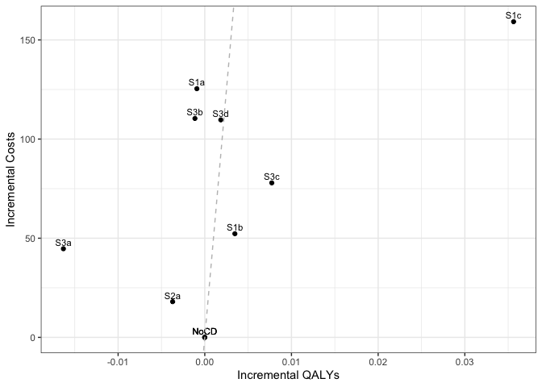

Case Detection Scenario Main Analysis
================
21 February, 2020

    ## Initializing the session

    ## [1] 0

**Global inputs:**

  - Medication adherence is 0.7
  - Smoking adherence is 0.7
  - Cost discounting: 0.015
  - QALY discounting: 0.015
  - Time horizon: 20
  - The WTP threshold for NMB is 50000

**Case detection inputs:**

  - Case detection occurs at 5 year intervals.
  - An outpatient diagnosis costs 61.18
  - The utility gain due to symptom relief from treatment is 0.0367

## S1 All patients scenario

All patients are eligible. The cost of case detection is:

<table>

<thead>

<tr>

<th style="text-align:right;">

None

</th>

<th style="text-align:right;">

CDQ17

</th>

<th style="text-align:right;">

FlowMeter

</th>

<th style="text-align:right;">

FlowMeter\_CDQ

</th>

</tr>

</thead>

<tbody>

<tr>

<td style="text-align:right;">

0

</td>

<td style="text-align:right;">

11.56

</td>

<td style="text-align:right;">

30.46

</td>

<td style="text-align:right;">

42.01

</td>

</tr>

</tbody>

</table>

#### S1NoCD2: No Case detection- Other time interval

    ## [1] 0

    ## Terminating the session

    ## [1] 0

#### S1NoCD: No Case detection

    ## Initializing the session

    ## [1] 0

    ## [1] 0

    ## Terminating the session

    ## [1] 0

#### S1A: CDQ ≥17 points

    ## Initializing the session

    ## [1] 0

    ## [1] 0

    ## Terminating the session

    ## [1] 0

#### S1B: Screening Spirometry with BD

    ## Initializing the session

    ## [1] 0

    ## [1] 0

    ## Terminating the session

    ## [1] 0

#### S1C: CDQ ≥17 points and Screening Spirometry with BD

    ## Initializing the session

    ## [1] 0

    ## [1] 0

    ## Terminating the session

    ## [1] 0

<table>

<thead>

<tr>

<th style="text-align:left;">

Scenario

</th>

<th style="text-align:right;">

Agents

</th>

<th style="text-align:right;">

PatientYears

</th>

<th style="text-align:right;">

CopdPYs

</th>

<th style="text-align:right;">

NCaseDetections

</th>

<th style="text-align:right;">

DiagnosedPYs

</th>

<th style="text-align:right;">

OverdiagnosedPYs

</th>

<th style="text-align:right;">

SABA

</th>

<th style="text-align:right;">

LAMA

</th>

<th style="text-align:right;">

LAMALABA

</th>

<th style="text-align:right;">

ICSLAMALABA

</th>

<th style="text-align:right;">

Mild

</th>

<th style="text-align:right;">

Moderate

</th>

<th style="text-align:right;">

Severe

</th>

<th style="text-align:right;">

VerySevere

</th>

<th style="text-align:right;">

MildPY

</th>

<th style="text-align:right;">

ModeratePY

</th>

<th style="text-align:right;">

SeverePY

</th>

<th style="text-align:right;">

VerySeverePY

</th>

<th style="text-align:right;">

NoCOPD

</th>

<th style="text-align:right;">

GOLD1

</th>

<th style="text-align:right;">

GOLD2

</th>

<th style="text-align:right;">

GOLD3

</th>

<th style="text-align:right;">

GOLD4

</th>

<th style="text-align:right;">

Cost

</th>

<th style="text-align:right;">

CostpAgent

</th>

<th style="text-align:right;">

QALY

</th>

<th style="text-align:right;">

QALYpAgent

</th>

<th style="text-align:right;">

NMB

</th>

<th style="text-align:right;">

IncrementalCosts

</th>

<th style="text-align:right;">

IncrementalQALY

</th>

<th style="text-align:right;">

ICER

</th>

<th style="text-align:right;">

IncrementalNMB

</th>

</tr>

</thead>

<tbody>

<tr>

<td style="text-align:left;">

S1NoCD2

</td>

<td style="text-align:right;">

37195539

</td>

<td style="text-align:right;">

625946560

</td>

<td style="text-align:right;">

71206641

</td>

<td style="text-align:right;">

190957851

</td>

<td style="text-align:right;">

13190152

</td>

<td style="text-align:right;">

13384480

</td>

<td style="text-align:right;">

0.017

</td>

<td style="text-align:right;">

0.135

</td>

<td style="text-align:right;">

0.151

</td>

<td style="text-align:right;">

0.080

</td>

<td style="text-align:right;">

15436546

</td>

<td style="text-align:right;">

2885846

</td>

<td style="text-align:right;">

4857447

</td>

<td style="text-align:right;">

418500.0

</td>

<td style="text-align:right;">

0.217

</td>

<td style="text-align:right;">

0.041

</td>

<td style="text-align:right;">

0.068

</td>

<td style="text-align:right;">

0.006

</td>

<td style="text-align:right;">

527334631

</td>

<td style="text-align:right;">

28873208

</td>

<td style="text-align:right;">

30748789

</td>

<td style="text-align:right;">

6899149

</td>

<td style="text-align:right;">

1202023

</td>

<td style="text-align:right;">

79972533446

</td>

<td style="text-align:right;">

2150.057

</td>

<td style="text-align:right;">

466598144

</td>

<td style="text-align:right;">

12.544

</td>

<td style="text-align:right;">

625073.2

</td>

<td style="text-align:right;">

0.000

</td>

<td style="text-align:right;">

0.000

</td>

<td style="text-align:right;">

NaN

</td>

<td style="text-align:right;">

0.000

</td>

</tr>

<tr>

<td style="text-align:left;">

S1NoCD

</td>

<td style="text-align:right;">

37198963

</td>

<td style="text-align:right;">

626066084

</td>

<td style="text-align:right;">

71127481

</td>

<td style="text-align:right;">

124683962

</td>

<td style="text-align:right;">

13308016

</td>

<td style="text-align:right;">

16324036

</td>

<td style="text-align:right;">

0.021

</td>

<td style="text-align:right;">

0.136

</td>

<td style="text-align:right;">

0.151

</td>

<td style="text-align:right;">

0.080

</td>

<td style="text-align:right;">

15401448

</td>

<td style="text-align:right;">

2881725

</td>

<td style="text-align:right;">

4850527

</td>

<td style="text-align:right;">

418589.0

</td>

<td style="text-align:right;">

0.217

</td>

<td style="text-align:right;">

0.041

</td>

<td style="text-align:right;">

0.068

</td>

<td style="text-align:right;">

0.006

</td>

<td style="text-align:right;">

527526200

</td>

<td style="text-align:right;">

28835415

</td>

<td style="text-align:right;">

30720742

</td>

<td style="text-align:right;">

6895543

</td>

<td style="text-align:right;">

1196229

</td>

<td style="text-align:right;">

80020147890

</td>

<td style="text-align:right;">

2151.139

</td>

<td style="text-align:right;">

466695513

</td>

<td style="text-align:right;">

12.546

</td>

<td style="text-align:right;">

625145.3

</td>

<td style="text-align:right;">

0.000

</td>

<td style="text-align:right;">

0.000

</td>

<td style="text-align:right;">

NaN

</td>

<td style="text-align:right;">

0.000

</td>

</tr>

<tr>

<td style="text-align:left;">

S1NoCDAvg

</td>

<td style="text-align:right;">

37197251

</td>

<td style="text-align:right;">

626006322

</td>

<td style="text-align:right;">

71167061

</td>

<td style="text-align:right;">

157820906

</td>

<td style="text-align:right;">

13249084

</td>

<td style="text-align:right;">

14854258

</td>

<td style="text-align:right;">

0.019

</td>

<td style="text-align:right;">

0.135

</td>

<td style="text-align:right;">

0.151

</td>

<td style="text-align:right;">

0.080

</td>

<td style="text-align:right;">

15418997

</td>

<td style="text-align:right;">

2883786

</td>

<td style="text-align:right;">

4853987

</td>

<td style="text-align:right;">

418544.5

</td>

<td style="text-align:right;">

0.217

</td>

<td style="text-align:right;">

0.041

</td>

<td style="text-align:right;">

0.068

</td>

<td style="text-align:right;">

0.006

</td>

<td style="text-align:right;">

527430416

</td>

<td style="text-align:right;">

28854312

</td>

<td style="text-align:right;">

30734766

</td>

<td style="text-align:right;">

6897346

</td>

<td style="text-align:right;">

1199126

</td>

<td style="text-align:right;">

79996340668

</td>

<td style="text-align:right;">

2150.598

</td>

<td style="text-align:right;">

466646828

</td>

<td style="text-align:right;">

12.545

</td>

<td style="text-align:right;">

625109.2

</td>

<td style="text-align:right;">

0.000

</td>

<td style="text-align:right;">

0.000

</td>

<td style="text-align:right;">

NaN

</td>

<td style="text-align:right;">

0.000

</td>

</tr>

<tr>

<td style="text-align:left;">

S1a

</td>

<td style="text-align:right;">

37190511

</td>

<td style="text-align:right;">

626044516

</td>

<td style="text-align:right;">

71225395

</td>

<td style="text-align:right;">

122762653

</td>

<td style="text-align:right;">

28514178

</td>

<td style="text-align:right;">

16315118

</td>

<td style="text-align:right;">

0.028

</td>

<td style="text-align:right;">

0.154

</td>

<td style="text-align:right;">

0.274

</td>

<td style="text-align:right;">

0.091

</td>

<td style="text-align:right;">

14999643

</td>

<td style="text-align:right;">

2827967

</td>

<td style="text-align:right;">

4774596

</td>

<td style="text-align:right;">

412680.0

</td>

<td style="text-align:right;">

0.211

</td>

<td style="text-align:right;">

0.040

</td>

<td style="text-align:right;">

0.067

</td>

<td style="text-align:right;">

0.006

</td>

<td style="text-align:right;">

527413067

</td>

<td style="text-align:right;">

28878816

</td>

<td style="text-align:right;">

30745037

</td>

<td style="text-align:right;">

6911026

</td>

<td style="text-align:right;">

1206715

</td>

<td style="text-align:right;">

87570365545

</td>

<td style="text-align:right;">

2354.643

</td>

<td style="text-align:right;">

467019427

</td>

<td style="text-align:right;">

12.557

</td>

<td style="text-align:right;">

625519.8

</td>

<td style="text-align:right;">

203.503

</td>

<td style="text-align:right;">

0.012

</td>

<td style="text-align:right;">

17602.85

</td>

<td style="text-align:right;">

374.538

</td>

</tr>

<tr>

<td style="text-align:left;">

S1b

</td>

<td style="text-align:right;">

37191498

</td>

<td style="text-align:right;">

625956427

</td>

<td style="text-align:right;">

71197357

</td>

<td style="text-align:right;">

123715756

</td>

<td style="text-align:right;">

20947757

</td>

<td style="text-align:right;">

16313791

</td>

<td style="text-align:right;">

0.024

</td>

<td style="text-align:right;">

0.145

</td>

<td style="text-align:right;">

0.216

</td>

<td style="text-align:right;">

0.086

</td>

<td style="text-align:right;">

15154974

</td>

<td style="text-align:right;">

2851053

</td>

<td style="text-align:right;">

4816810

</td>

<td style="text-align:right;">

416006.0

</td>

<td style="text-align:right;">

0.213

</td>

<td style="text-align:right;">

0.040

</td>

<td style="text-align:right;">

0.068

</td>

<td style="text-align:right;">

0.006

</td>

<td style="text-align:right;">

527355100

</td>

<td style="text-align:right;">

28897541

</td>

<td style="text-align:right;">

30727055

</td>

<td style="text-align:right;">

6892183

</td>

<td style="text-align:right;">

1196624

</td>

<td style="text-align:right;">

85462111954

</td>

<td style="text-align:right;">

2297.894

</td>

<td style="text-align:right;">

466789476

</td>

<td style="text-align:right;">

12.551

</td>

<td style="text-align:right;">

625250.7

</td>

<td style="text-align:right;">

146.755

</td>

<td style="text-align:right;">

0.005

</td>

<td style="text-align:right;">

29091.01

</td>

<td style="text-align:right;">

105.479

</td>

</tr>

<tr>

<td style="text-align:left;">

S1c

</td>

<td style="text-align:right;">

37192985

</td>

<td style="text-align:right;">

626040234

</td>

<td style="text-align:right;">

71176668

</td>

<td style="text-align:right;">

124038411

</td>

<td style="text-align:right;">

18502087

</td>

<td style="text-align:right;">

16327571

</td>

<td style="text-align:right;">

0.023

</td>

<td style="text-align:right;">

0.142

</td>

<td style="text-align:right;">

0.196

</td>

<td style="text-align:right;">

0.084

</td>

<td style="text-align:right;">

15229809

</td>

<td style="text-align:right;">

2862176

</td>

<td style="text-align:right;">

4820579

</td>

<td style="text-align:right;">

416318.0

</td>

<td style="text-align:right;">

0.214

</td>

<td style="text-align:right;">

0.040

</td>

<td style="text-align:right;">

0.068

</td>

<td style="text-align:right;">

0.006

</td>

<td style="text-align:right;">

527453772

</td>

<td style="text-align:right;">

28871146

</td>

<td style="text-align:right;">

30722722

</td>

<td style="text-align:right;">

6902323

</td>

<td style="text-align:right;">

1199226

</td>

<td style="text-align:right;">

85934707139

</td>

<td style="text-align:right;">

2310.508

</td>

<td style="text-align:right;">

466794241

</td>

<td style="text-align:right;">

12.551

</td>

<td style="text-align:right;">

625219.4

</td>

<td style="text-align:right;">

159.369

</td>

<td style="text-align:right;">

0.005

</td>

<td style="text-align:right;">

34118.95

</td>

<td style="text-align:right;">

74.180

</td>

</tr>

</tbody>

</table>

*Treatment rate:* SABA is expressed per all patient-years, LAMA,
LAMA/LABA, ICS/LAMA/LABA are per COPD patient-years *Exacerbations:*
Total exacerbations and rate per COPD patient-year: *GOLD Stage:*
Cumulative patient-years *Cost/QALY:* Total cost and QALYs *NMB:* Net
Monetary Benefit is calculated as QALY per patient-year \* Lamba - Cost
per patient-year

-----

## S2 Symptomatic patients scenario

Patients with symptoms at year 1 are eligible. The cost of case
detection is:

    ## Initializing the session

    ## [1] 0

<table>

<thead>

<tr>

<th style="text-align:right;">

None

</th>

<th style="text-align:right;">

FlowMeter

</th>

</tr>

</thead>

<tbody>

<tr>

<td style="text-align:right;">

0

</td>

<td style="text-align:right;">

24.33

</td>

</tr>

</tbody>

</table>

#### S2NoCD: No Case detection

    ## [1] 0

    ## Terminating the session

    ## [1] 0

#### S2a: Screening Spirometry without BD

    ## Initializing the session

    ## [1] 0

    ## [1] 0

    ## Terminating the session

    ## [1] 0

<table>

<thead>

<tr>

<th style="text-align:left;">

Scenario

</th>

<th style="text-align:right;">

Agents

</th>

<th style="text-align:right;">

PatientYears

</th>

<th style="text-align:right;">

CopdPYs

</th>

<th style="text-align:right;">

NCaseDetections

</th>

<th style="text-align:right;">

DiagnosedPYs

</th>

<th style="text-align:right;">

OverdiagnosedPYs

</th>

<th style="text-align:right;">

SABA

</th>

<th style="text-align:right;">

LAMA

</th>

<th style="text-align:right;">

LAMALABA

</th>

<th style="text-align:right;">

ICSLAMALABA

</th>

<th style="text-align:right;">

Mild

</th>

<th style="text-align:right;">

Moderate

</th>

<th style="text-align:right;">

Severe

</th>

<th style="text-align:right;">

VerySevere

</th>

<th style="text-align:right;">

MildPY

</th>

<th style="text-align:right;">

ModeratePY

</th>

<th style="text-align:right;">

SeverePY

</th>

<th style="text-align:right;">

VerySeverePY

</th>

<th style="text-align:right;">

NoCOPD

</th>

<th style="text-align:right;">

GOLD1

</th>

<th style="text-align:right;">

GOLD2

</th>

<th style="text-align:right;">

GOLD3

</th>

<th style="text-align:right;">

GOLD4

</th>

<th style="text-align:right;">

Cost

</th>

<th style="text-align:right;">

CostpAgent

</th>

<th style="text-align:right;">

QALY

</th>

<th style="text-align:right;">

QALYpAgent

</th>

<th style="text-align:right;">

NMB

</th>

<th style="text-align:right;">

IncrementalCosts

</th>

<th style="text-align:right;">

IncrementalQALY

</th>

<th style="text-align:right;">

ICER

</th>

<th style="text-align:right;">

IncrementalNMB

</th>

</tr>

</thead>

<tbody>

<tr>

<td style="text-align:left;">

S2NoCD

</td>

<td style="text-align:right;">

22074226

</td>

<td style="text-align:right;">

364452256

</td>

<td style="text-align:right;">

50171470

</td>

<td style="text-align:right;">

72487800

</td>

<td style="text-align:right;">

9750176

</td>

<td style="text-align:right;">

9420821

</td>

<td style="text-align:right;">

0.021

</td>

<td style="text-align:right;">

0.142

</td>

<td style="text-align:right;">

0.160

</td>

<td style="text-align:right;">

0.087

</td>

<td style="text-align:right;">

11448689

</td>

<td style="text-align:right;">

2123592

</td>

<td style="text-align:right;">

3546984

</td>

<td style="text-align:right;">

304701

</td>

<td style="text-align:right;">

0.228

</td>

<td style="text-align:right;">

0.042

</td>

<td style="text-align:right;">

0.071

</td>

<td style="text-align:right;">

0.006

</td>

<td style="text-align:right;">

298716874

</td>

<td style="text-align:right;">

18609248

</td>

<td style="text-align:right;">

22516464

</td>

<td style="text-align:right;">

5559083

</td>

<td style="text-align:right;">

1026070

</td>

<td style="text-align:right;">

58878017491

</td>

<td style="text-align:right;">

2667.274

</td>

<td style="text-align:right;">

270861434

</td>

<td style="text-align:right;">

12.270

</td>

<td style="text-align:right;">

610856.9

</td>

<td style="text-align:right;">

0.00

</td>

<td style="text-align:right;">

0.000

</td>

<td style="text-align:right;">

NaN

</td>

<td style="text-align:right;">

0.000

</td>

</tr>

<tr>

<td style="text-align:left;">

S2a

</td>

<td style="text-align:right;">

22080710

</td>

<td style="text-align:right;">

364584647

</td>

<td style="text-align:right;">

50224042

</td>

<td style="text-align:right;">

71688392

</td>

<td style="text-align:right;">

16284311

</td>

<td style="text-align:right;">

9438310

</td>

<td style="text-align:right;">

0.025

</td>

<td style="text-align:right;">

0.153

</td>

<td style="text-align:right;">

0.241

</td>

<td style="text-align:right;">

0.095

</td>

<td style="text-align:right;">

11250292

</td>

<td style="text-align:right;">

2096985

</td>

<td style="text-align:right;">

3509584

</td>

<td style="text-align:right;">

303262

</td>

<td style="text-align:right;">

0.224

</td>

<td style="text-align:right;">

0.042

</td>

<td style="text-align:right;">

0.070

</td>

<td style="text-align:right;">

0.006

</td>

<td style="text-align:right;">

298795110

</td>

<td style="text-align:right;">

18640658

</td>

<td style="text-align:right;">

22534110

</td>

<td style="text-align:right;">

5559958

</td>

<td style="text-align:right;">

1027122

</td>

<td style="text-align:right;">

62387144865

</td>

<td style="text-align:right;">

2825.414

</td>

<td style="text-align:right;">

271116999

</td>

<td style="text-align:right;">

12.278

</td>

<td style="text-align:right;">

611097.3

</td>

<td style="text-align:right;">

158.14

</td>

<td style="text-align:right;">

0.008

</td>

<td style="text-align:right;">

19839.68

</td>

<td style="text-align:right;">

240.404

</td>

</tr>

</tbody>

</table>

*Treatment rate:* SABA is expressed per all patient-years, LAMA,
LAMA/LABA, ICS/LAMA/LABA are per COPD patient-years *Exacerbations:*
Total exacerbations and rate per COPD patient-year: *GOLD Stage:*
Cumulative patient-years *Cost/QALY:* Total cost and QALYs *NMB:* Net
Monetary Benefit is calculated as QALY per patient-year \* Lamba - Cost
per patient-year

-----

## S3 Smoking history scenario

Ever smokers ≥50 years of age are eligible. The cost of case detection
is:

    ## Initializing the session

    ## [1] 0

<table>

<thead>

<tr>

<th style="text-align:right;">

None

</th>

<th style="text-align:right;">

CDQ195

</th>

<th style="text-align:right;">

CDQ165

</th>

<th style="text-align:right;">

FlowMeter

</th>

<th style="text-align:right;">

FlowMeter\_CDQ

</th>

</tr>

</thead>

<tbody>

<tr>

<td style="text-align:right;">

0

</td>

<td style="text-align:right;">

11.56

</td>

<td style="text-align:right;">

11.56

</td>

<td style="text-align:right;">

24.33

</td>

<td style="text-align:right;">

42.01

</td>

</tr>

</tbody>

</table>

#### S3NoCD: No Case detection

    ## [1] 0

    ## Terminating the session

    ## [1] 0

#### S3a: CDQ ≥19.5 points

    ## Initializing the session

    ## [1] 0

    ## [1] 0

    ## Terminating the session

    ## [1] 0

#### S3b: CDQ ≥16.5 points

    ## Initializing the session

    ## [1] 0

    ## [1] 0

    ## Terminating the session

    ## [1] 0

#### S3c: Screening spirometry without BD

    ## Initializing the session

    ## [1] 0

    ## [1] 0

    ## Terminating the session

    ## [1] 0

#### S3d: Screening Spirometry with BD + CDQ ≥17 points

    ## Initializing the session

    ## [1] 0

    ## [1] 0

    ## Terminating the session

    ## [1] 0

<table>

<thead>

<tr>

<th style="text-align:left;">

Scenario

</th>

<th style="text-align:right;">

Agents

</th>

<th style="text-align:right;">

PatientYears

</th>

<th style="text-align:right;">

CopdPYs

</th>

<th style="text-align:right;">

NCaseDetections

</th>

<th style="text-align:right;">

DiagnosedPYs

</th>

<th style="text-align:right;">

OverdiagnosedPYs

</th>

<th style="text-align:right;">

SABA

</th>

<th style="text-align:right;">

LAMA

</th>

<th style="text-align:right;">

LAMALABA

</th>

<th style="text-align:right;">

ICSLAMALABA

</th>

<th style="text-align:right;">

Mild

</th>

<th style="text-align:right;">

Moderate

</th>

<th style="text-align:right;">

Severe

</th>

<th style="text-align:right;">

VerySevere

</th>

<th style="text-align:right;">

MildPY

</th>

<th style="text-align:right;">

ModeratePY

</th>

<th style="text-align:right;">

SeverePY

</th>

<th style="text-align:right;">

VerySeverePY

</th>

<th style="text-align:right;">

NoCOPD

</th>

<th style="text-align:right;">

GOLD1

</th>

<th style="text-align:right;">

GOLD2

</th>

<th style="text-align:right;">

GOLD3

</th>

<th style="text-align:right;">

GOLD4

</th>

<th style="text-align:right;">

Cost

</th>

<th style="text-align:right;">

CostpAgent

</th>

<th style="text-align:right;">

QALY

</th>

<th style="text-align:right;">

QALYpAgent

</th>

<th style="text-align:right;">

NMB

</th>

<th style="text-align:right;">

IncrementalCosts

</th>

<th style="text-align:right;">

IncrementalQALY

</th>

<th style="text-align:right;">

ICER

</th>

<th style="text-align:right;">

IncrementalNMB

</th>

</tr>

</thead>

<tbody>

<tr>

<td style="text-align:left;">

S3NoCD

</td>

<td style="text-align:right;">

17247148

</td>

<td style="text-align:right;">

260057993

</td>

<td style="text-align:right;">

41743509

</td>

<td style="text-align:right;">

52432476

</td>

<td style="text-align:right;">

7915734

</td>

<td style="text-align:right;">

7057874

</td>

<td style="text-align:right;">

0.022

</td>

<td style="text-align:right;">

0.137

</td>

<td style="text-align:right;">

0.155

</td>

<td style="text-align:right;">

0.086

</td>

<td style="text-align:right;">

9754339

</td>

<td style="text-align:right;">

1817880

</td>

<td style="text-align:right;">

3045318

</td>

<td style="text-align:right;">

261451

</td>

<td style="text-align:right;">

0.234

</td>

<td style="text-align:right;">

0.044

</td>

<td style="text-align:right;">

0.073

</td>

<td style="text-align:right;">

0.006

</td>

<td style="text-align:right;">

207422668

</td>

<td style="text-align:right;">

15309850

</td>

<td style="text-align:right;">

18711782

</td>

<td style="text-align:right;">

4815486

</td>

<td style="text-align:right;">

892340

</td>

<td style="text-align:right;">

50080509603

</td>

<td style="text-align:right;">

2903.698

</td>

<td style="text-align:right;">

193703479

</td>

<td style="text-align:right;">

11.231

</td>

<td style="text-align:right;">

558648.5

</td>

<td style="text-align:right;">

0.000

</td>

<td style="text-align:right;">

0.000

</td>

<td style="text-align:right;">

NaN

</td>

<td style="text-align:right;">

0.000

</td>

</tr>

<tr>

<td style="text-align:left;">

S3a

</td>

<td style="text-align:right;">

17248098

</td>

<td style="text-align:right;">

260136279

</td>

<td style="text-align:right;">

41803343

</td>

<td style="text-align:right;">

52175312

</td>

<td style="text-align:right;">

10153430

</td>

<td style="text-align:right;">

7058934

</td>

<td style="text-align:right;">

0.024

</td>

<td style="text-align:right;">

0.142

</td>

<td style="text-align:right;">

0.189

</td>

<td style="text-align:right;">

0.090

</td>

<td style="text-align:right;">

9696278

</td>

<td style="text-align:right;">

1811331

</td>

<td style="text-align:right;">

3030218

</td>

<td style="text-align:right;">

261182

</td>

<td style="text-align:right;">

0.232

</td>

<td style="text-align:right;">

0.043

</td>

<td style="text-align:right;">

0.072

</td>

<td style="text-align:right;">

0.006

</td>

<td style="text-align:right;">

207441398

</td>

<td style="text-align:right;">

15324174

</td>

<td style="text-align:right;">

18731769

</td>

<td style="text-align:right;">

4833465

</td>

<td style="text-align:right;">

896864

</td>

<td style="text-align:right;">

52161533045

</td>

<td style="text-align:right;">

3024.190

</td>

<td style="text-align:right;">

193808114

</td>

<td style="text-align:right;">

11.236

</td>

<td style="text-align:right;">

558800.4

</td>

<td style="text-align:right;">

120.492

</td>

<td style="text-align:right;">

0.005

</td>

<td style="text-align:right;">

22117.21

</td>

<td style="text-align:right;">

151.903

</td>

</tr>

<tr>

<td style="text-align:left;">

S3b

</td>

<td style="text-align:right;">

17246133

</td>

<td style="text-align:right;">

260104141

</td>

<td style="text-align:right;">

41792872

</td>

<td style="text-align:right;">

51575516

</td>

<td style="text-align:right;">

14910123

</td>

<td style="text-align:right;">

7062660

</td>

<td style="text-align:right;">

0.029

</td>

<td style="text-align:right;">

0.152

</td>

<td style="text-align:right;">

0.259

</td>

<td style="text-align:right;">

0.096

</td>

<td style="text-align:right;">

9551088

</td>

<td style="text-align:right;">

1792031

</td>

<td style="text-align:right;">

3006778

</td>

<td style="text-align:right;">

258913

</td>

<td style="text-align:right;">

0.229

</td>

<td style="text-align:right;">

0.043

</td>

<td style="text-align:right;">

0.072

</td>

<td style="text-align:right;">

0.006

</td>

<td style="text-align:right;">

207420843

</td>

<td style="text-align:right;">

15305535

</td>

<td style="text-align:right;">

18735905

</td>

<td style="text-align:right;">

4835554

</td>

<td style="text-align:right;">

899319

</td>

<td style="text-align:right;">

53695335114

</td>

<td style="text-align:right;">

3113.471

</td>

<td style="text-align:right;">

193898328

</td>

<td style="text-align:right;">

11.243

</td>

<td style="text-align:right;">

559036.7

</td>

<td style="text-align:right;">

209.773

</td>

<td style="text-align:right;">

0.012

</td>

<td style="text-align:right;">

17540.81

</td>

<td style="text-align:right;">

388.184

</td>

</tr>

<tr>

<td style="text-align:left;">

S3c

</td>

<td style="text-align:right;">

17251323

</td>

<td style="text-align:right;">

260181345

</td>

<td style="text-align:right;">

41800520

</td>

<td style="text-align:right;">

51905633

</td>

<td style="text-align:right;">

12440932

</td>

<td style="text-align:right;">

7053131

</td>

<td style="text-align:right;">

0.026

</td>

<td style="text-align:right;">

0.147

</td>

<td style="text-align:right;">

0.223

</td>

<td style="text-align:right;">

0.093

</td>

<td style="text-align:right;">

9632483

</td>

<td style="text-align:right;">

1800769

</td>

<td style="text-align:right;">

3017770

</td>

<td style="text-align:right;">

259216

</td>

<td style="text-align:right;">

0.230

</td>

<td style="text-align:right;">

0.043

</td>

<td style="text-align:right;">

0.072

</td>

<td style="text-align:right;">

0.006

</td>

<td style="text-align:right;">

207486907

</td>

<td style="text-align:right;">

15306913

</td>

<td style="text-align:right;">

18742473

</td>

<td style="text-align:right;">

4832434

</td>

<td style="text-align:right;">

901480

</td>

<td style="text-align:right;">

52717881276

</td>

<td style="text-align:right;">

3055.875

</td>

<td style="text-align:right;">

193897276

</td>

<td style="text-align:right;">

11.240

</td>

<td style="text-align:right;">

558922.1

</td>

<td style="text-align:right;">

152.177

</td>

<td style="text-align:right;">

0.009

</td>

<td style="text-align:right;">

17870.03

</td>

<td style="text-align:right;">

273.611

</td>

</tr>

<tr>

<td style="text-align:left;">

S3d

</td>

<td style="text-align:right;">

17249006

</td>

<td style="text-align:right;">

260132184

</td>

<td style="text-align:right;">

41790237

</td>

<td style="text-align:right;">

52025750

</td>

<td style="text-align:right;">

11377401

</td>

<td style="text-align:right;">

7062357

</td>

<td style="text-align:right;">

0.025

</td>

<td style="text-align:right;">

0.144

</td>

<td style="text-align:right;">

0.208

</td>

<td style="text-align:right;">

0.091

</td>

<td style="text-align:right;">

9662426

</td>

<td style="text-align:right;">

1802633

</td>

<td style="text-align:right;">

3024242

</td>

<td style="text-align:right;">

260337

</td>

<td style="text-align:right;">

0.231

</td>

<td style="text-align:right;">

0.043

</td>

<td style="text-align:right;">

0.072

</td>

<td style="text-align:right;">

0.006

</td>

<td style="text-align:right;">

207449446

</td>

<td style="text-align:right;">

15307342

</td>

<td style="text-align:right;">

18736111

</td>

<td style="text-align:right;">

4826665

</td>

<td style="text-align:right;">

902747

</td>

<td style="text-align:right;">

52893800213

</td>

<td style="text-align:right;">

3066.484

</td>

<td style="text-align:right;">

193834886

</td>

<td style="text-align:right;">

11.237

</td>

<td style="text-align:right;">

558806.1

</td>

<td style="text-align:right;">

162.786

</td>

<td style="text-align:right;">

0.006

</td>

<td style="text-align:right;">

25401.61

</td>

<td style="text-align:right;">

157.638

</td>

</tr>

</tbody>

</table>

*Treatment rate:* SABA is expressed per all patient-years, LAMA,
LAMA/LABA, ICS/LAMA/LABA are per COPD patient-years *Exacerbations:*
Total exacerbations and rate per COPD patient-year *GOLD Stage:*
Cumulative patient-years *Cost/QALY:* Total cost and QALYs *NMB:* Net
Monetary Benefit is calculated as QALY per patient-year \* Lamba - Cost
per patient-year

-----

## All Scenarios

*Ordered by descending Net Monetary Benefit*

<table>

<thead>

<tr>

<th style="text-align:left;">

Scenario

</th>

<th style="text-align:right;">

Agents

</th>

<th style="text-align:right;">

Cost

</th>

<th style="text-align:right;">

CostpAgent

</th>

<th style="text-align:right;">

QALY

</th>

<th style="text-align:right;">

QALYpAgent

</th>

<th style="text-align:right;">

ICER

</th>

<th style="text-align:right;">

IncrementalNMB

</th>

</tr>

</thead>

<tbody>

<tr>

<td style="text-align:left;">

S3b

</td>

<td style="text-align:right;">

17246133

</td>

<td style="text-align:right;">

53695335114

</td>

<td style="text-align:right;">

3113.471

</td>

<td style="text-align:right;">

193898328

</td>

<td style="text-align:right;">

11.243

</td>

<td style="text-align:right;">

17540.81

</td>

<td style="text-align:right;">

388.184

</td>

</tr>

<tr>

<td style="text-align:left;">

S1a

</td>

<td style="text-align:right;">

37190511

</td>

<td style="text-align:right;">

87570365545

</td>

<td style="text-align:right;">

2354.643

</td>

<td style="text-align:right;">

467019427

</td>

<td style="text-align:right;">

12.557

</td>

<td style="text-align:right;">

17602.85

</td>

<td style="text-align:right;">

374.538

</td>

</tr>

<tr>

<td style="text-align:left;">

S3c

</td>

<td style="text-align:right;">

17251323

</td>

<td style="text-align:right;">

52717881276

</td>

<td style="text-align:right;">

3055.875

</td>

<td style="text-align:right;">

193897276

</td>

<td style="text-align:right;">

11.240

</td>

<td style="text-align:right;">

17870.03

</td>

<td style="text-align:right;">

273.611

</td>

</tr>

<tr>

<td style="text-align:left;">

S2a

</td>

<td style="text-align:right;">

22080710

</td>

<td style="text-align:right;">

62387144865

</td>

<td style="text-align:right;">

2825.414

</td>

<td style="text-align:right;">

271116999

</td>

<td style="text-align:right;">

12.278

</td>

<td style="text-align:right;">

19839.68

</td>

<td style="text-align:right;">

240.404

</td>

</tr>

<tr>

<td style="text-align:left;">

S3d

</td>

<td style="text-align:right;">

17249006

</td>

<td style="text-align:right;">

52893800213

</td>

<td style="text-align:right;">

3066.484

</td>

<td style="text-align:right;">

193834886

</td>

<td style="text-align:right;">

11.237

</td>

<td style="text-align:right;">

25401.61

</td>

<td style="text-align:right;">

157.638

</td>

</tr>

<tr>

<td style="text-align:left;">

S3a

</td>

<td style="text-align:right;">

17248098

</td>

<td style="text-align:right;">

52161533045

</td>

<td style="text-align:right;">

3024.190

</td>

<td style="text-align:right;">

193808114

</td>

<td style="text-align:right;">

11.236

</td>

<td style="text-align:right;">

22117.21

</td>

<td style="text-align:right;">

151.903

</td>

</tr>

<tr>

<td style="text-align:left;">

S1b

</td>

<td style="text-align:right;">

37191498

</td>

<td style="text-align:right;">

85462111954

</td>

<td style="text-align:right;">

2297.894

</td>

<td style="text-align:right;">

466789476

</td>

<td style="text-align:right;">

12.551

</td>

<td style="text-align:right;">

29091.01

</td>

<td style="text-align:right;">

105.479

</td>

</tr>

<tr>

<td style="text-align:left;">

S1c

</td>

<td style="text-align:right;">

37192985

</td>

<td style="text-align:right;">

85934707139

</td>

<td style="text-align:right;">

2310.508

</td>

<td style="text-align:right;">

466794241

</td>

<td style="text-align:right;">

12.551

</td>

<td style="text-align:right;">

34118.95

</td>

<td style="text-align:right;">

74.180

</td>

</tr>

<tr>

<td style="text-align:left;">

S1NoCD

</td>

<td style="text-align:right;">

37198963

</td>

<td style="text-align:right;">

80020147890

</td>

<td style="text-align:right;">

2151.139

</td>

<td style="text-align:right;">

466695513

</td>

<td style="text-align:right;">

12.546

</td>

<td style="text-align:right;">

NaN

</td>

<td style="text-align:right;">

0.000

</td>

</tr>

<tr>

<td style="text-align:left;">

S2NoCD

</td>

<td style="text-align:right;">

22074226

</td>

<td style="text-align:right;">

58878017491

</td>

<td style="text-align:right;">

2667.274

</td>

<td style="text-align:right;">

270861434

</td>

<td style="text-align:right;">

12.270

</td>

<td style="text-align:right;">

NaN

</td>

<td style="text-align:right;">

0.000

</td>

</tr>

<tr>

<td style="text-align:left;">

S3NoCD

</td>

<td style="text-align:right;">

17247148

</td>

<td style="text-align:right;">

50080509603

</td>

<td style="text-align:right;">

2903.698

</td>

<td style="text-align:right;">

193703479

</td>

<td style="text-align:right;">

11.231

</td>

<td style="text-align:right;">

NaN

</td>

<td style="text-align:right;">

0.000

</td>

</tr>

</tbody>

</table>

-----

## Cost Effectiveness Plane

Adjusted to the total population

<table>

<thead>

<tr>

<th style="text-align:left;">

Scenario

</th>

<th style="text-align:right;">

Agents

</th>

<th style="text-align:right;">

PropAgents

</th>

<th style="text-align:right;">

Cost

</th>

<th style="text-align:right;">

CostpAgent

</th>

<th style="text-align:right;">

CostpAgentExcluded

</th>

<th style="text-align:right;">

CostpAgentAll

</th>

<th style="text-align:right;">

QALY

</th>

<th style="text-align:right;">

QALYpAgent

</th>

<th style="text-align:right;">

QALYpAgentExcluded

</th>

<th style="text-align:right;">

QALYpAgentAll

</th>

<th style="text-align:right;">

IncrementalCosts

</th>

<th style="text-align:right;">

IncrementalQALY

</th>

<th style="text-align:right;">

ICERAdj

</th>

<th style="text-align:right;">

ICER

</th>

<th style="text-align:right;">

INMB

</th>

</tr>

</thead>

<tbody>

<tr>

<td style="text-align:left;">

S1NoCDAvg

</td>

<td style="text-align:right;">

37197251

</td>

<td style="text-align:right;">

1.0000000

</td>

<td style="text-align:right;">

79996340668

</td>

<td style="text-align:right;">

2150.598

</td>

<td style="text-align:right;">

0.000

</td>

<td style="text-align:right;">

2150.598

</td>

<td style="text-align:right;">

466646828

</td>

<td style="text-align:right;">

12.54520

</td>

<td style="text-align:right;">

0.00000

</td>

<td style="text-align:right;">

12.54520

</td>

<td style="text-align:right;">

0.00000

</td>

<td style="text-align:right;">

0.0000000

</td>

<td style="text-align:right;">

NaN

</td>

<td style="text-align:right;">

NaN

</td>

<td style="text-align:right;">

0.00000

</td>

</tr>

<tr>

<td style="text-align:left;">

S1a

</td>

<td style="text-align:right;">

37190511

</td>

<td style="text-align:right;">

1.0000000

</td>

<td style="text-align:right;">

87570365545

</td>

<td style="text-align:right;">

2354.643

</td>

<td style="text-align:right;">

0.000

</td>

<td style="text-align:right;">

2354.643

</td>

<td style="text-align:right;">

467019427

</td>

<td style="text-align:right;">

12.55749

</td>

<td style="text-align:right;">

0.00000

</td>

<td style="text-align:right;">

12.55749

</td>

<td style="text-align:right;">

204.04452

</td>

<td style="text-align:right;">

0.0122922

</td>

<td style="text-align:right;">

16599.50

</td>

<td style="text-align:right;">

17602.85

</td>

<td style="text-align:right;">

410.56586

</td>

</tr>

<tr>

<td style="text-align:left;">

S1b

</td>

<td style="text-align:right;">

37191498

</td>

<td style="text-align:right;">

1.0000000

</td>

<td style="text-align:right;">

85462111954

</td>

<td style="text-align:right;">

2297.894

</td>

<td style="text-align:right;">

0.000

</td>

<td style="text-align:right;">

2297.894

</td>

<td style="text-align:right;">

466789476

</td>

<td style="text-align:right;">

12.55097

</td>

<td style="text-align:right;">

0.00000

</td>

<td style="text-align:right;">

12.55097

</td>

<td style="text-align:right;">

147.29559

</td>

<td style="text-align:right;">

0.0057761

</td>

<td style="text-align:right;">

25501.07

</td>

<td style="text-align:right;">

29091.01

</td>

<td style="text-align:right;">

141.50716

</td>

</tr>

<tr>

<td style="text-align:left;">

S1c

</td>

<td style="text-align:right;">

37192985

</td>

<td style="text-align:right;">

1.0000000

</td>

<td style="text-align:right;">

85934707139

</td>

<td style="text-align:right;">

2310.508

</td>

<td style="text-align:right;">

0.000

</td>

<td style="text-align:right;">

2310.508

</td>

<td style="text-align:right;">

466794241

</td>

<td style="text-align:right;">

12.55060

</td>

<td style="text-align:right;">

0.00000

</td>

<td style="text-align:right;">

12.55060

</td>

<td style="text-align:right;">

159.91029

</td>

<td style="text-align:right;">

0.0054024

</td>

<td style="text-align:right;">

29600.00

</td>

<td style="text-align:right;">

34118.95

</td>

<td style="text-align:right;">

110.20840

</td>

</tr>

<tr>

<td style="text-align:left;">

S2NoCD

</td>

<td style="text-align:right;">

22074226

</td>

<td style="text-align:right;">

0.5934370

</td>

<td style="text-align:right;">

58878017491

</td>

<td style="text-align:right;">

2667.274

</td>

<td style="text-align:right;">

1396.435

</td>

<td style="text-align:right;">

2150.598

</td>

<td style="text-align:right;">

270861434

</td>

<td style="text-align:right;">

12.27048

</td>

<td style="text-align:right;">

12.94618

</td>

<td style="text-align:right;">

12.54520

</td>

<td style="text-align:right;">

0.00000

</td>

<td style="text-align:right;">

0.0000000

</td>

<td style="text-align:right;">

NaN

</td>

<td style="text-align:right;">

NaN

</td>

<td style="text-align:right;">

0.00000

</td>

</tr>

<tr>

<td style="text-align:left;">

S2a

</td>

<td style="text-align:right;">

22080710

</td>

<td style="text-align:right;">

0.5936113

</td>

<td style="text-align:right;">

62387144865

</td>

<td style="text-align:right;">

2825.414

</td>

<td style="text-align:right;">

1396.435

</td>

<td style="text-align:right;">

2244.693

</td>

<td style="text-align:right;">

271116999

</td>

<td style="text-align:right;">

12.27845

</td>

<td style="text-align:right;">

12.94618

</td>

<td style="text-align:right;">

12.54981

</td>

<td style="text-align:right;">

94.09493

</td>

<td style="text-align:right;">

0.0046138

</td>

<td style="text-align:right;">

20394.17

</td>

<td style="text-align:right;">

19839.68

</td>

<td style="text-align:right;">

136.59587

</td>

</tr>

<tr>

<td style="text-align:left;">

S3NoCD

</td>

<td style="text-align:right;">

17247148

</td>

<td style="text-align:right;">

0.4636673

</td>

<td style="text-align:right;">

50080509603

</td>

<td style="text-align:right;">

2903.698

</td>

<td style="text-align:right;">

1499.533

</td>

<td style="text-align:right;">

2150.598

</td>

<td style="text-align:right;">

193703479

</td>

<td style="text-align:right;">

11.23104

</td>

<td style="text-align:right;">

13.68130

</td>

<td style="text-align:right;">

12.54520

</td>

<td style="text-align:right;">

0.00000

</td>

<td style="text-align:right;">

0.0000000

</td>

<td style="text-align:right;">

NaN

</td>

<td style="text-align:right;">

NaN

</td>

<td style="text-align:right;">

0.00000

</td>

</tr>

<tr>

<td style="text-align:left;">

S3a

</td>

<td style="text-align:right;">

17248098

</td>

<td style="text-align:right;">

0.4636928

</td>

<td style="text-align:right;">

52161533045

</td>

<td style="text-align:right;">

3024.190

</td>

<td style="text-align:right;">

1499.533

</td>

<td style="text-align:right;">

2206.506

</td>

<td style="text-align:right;">

193808114

</td>

<td style="text-align:right;">

11.23649

</td>

<td style="text-align:right;">

13.68130

</td>

<td style="text-align:right;">

12.54766

</td>

<td style="text-align:right;">

55.90733

</td>

<td style="text-align:right;">

0.0024636

</td>

<td style="text-align:right;">

22693.58

</td>

<td style="text-align:right;">

22117.21

</td>

<td style="text-align:right;">

67.27141

</td>

</tr>

<tr>

<td style="text-align:left;">

S3b

</td>

<td style="text-align:right;">

17246133

</td>

<td style="text-align:right;">

0.4636400

</td>

<td style="text-align:right;">

53695335114

</td>

<td style="text-align:right;">

3113.471

</td>

<td style="text-align:right;">

1499.533

</td>

<td style="text-align:right;">

2247.819

</td>

<td style="text-align:right;">

193898328

</td>

<td style="text-align:right;">

11.24300

</td>

<td style="text-align:right;">

13.68130

</td>

<td style="text-align:right;">

12.55081

</td>

<td style="text-align:right;">

97.22083

</td>

<td style="text-align:right;">

0.0056116

</td>

<td style="text-align:right;">

17324.99

</td>

<td style="text-align:right;">

17540.81

</td>

<td style="text-align:right;">

183.35891

</td>

</tr>

<tr>

<td style="text-align:left;">

S3c

</td>

<td style="text-align:right;">

17251323

</td>

<td style="text-align:right;">

0.4637795

</td>

<td style="text-align:right;">

52717881276

</td>

<td style="text-align:right;">

3055.875

</td>

<td style="text-align:right;">

1499.533

</td>

<td style="text-align:right;">

2221.332

</td>

<td style="text-align:right;">

193897276

</td>

<td style="text-align:right;">

11.23956

</td>

<td style="text-align:right;">

13.68130

</td>

<td style="text-align:right;">

12.54887

</td>

<td style="text-align:right;">

70.73402

</td>

<td style="text-align:right;">

0.0036744

</td>

<td style="text-align:right;">

19250.43

</td>

<td style="text-align:right;">

17870.04

</td>

<td style="text-align:right;">

112.98661

</td>

</tr>

<tr>

<td style="text-align:left;">

S3d

</td>

<td style="text-align:right;">

17249006

</td>

<td style="text-align:right;">

0.4637172

</td>

<td style="text-align:right;">

52893800213

</td>

<td style="text-align:right;">

3066.484

</td>

<td style="text-align:right;">

1499.533

</td>

<td style="text-align:right;">

2226.155

</td>

<td style="text-align:right;">

193834886

</td>

<td style="text-align:right;">

11.23745

</td>

<td style="text-align:right;">

13.68130

</td>

<td style="text-align:right;">

12.54805

</td>

<td style="text-align:right;">

75.55678

</td>

<td style="text-align:right;">

0.0028493

</td>

<td style="text-align:right;">

26517.33

</td>

<td style="text-align:right;">

25401.61

</td>

<td style="text-align:right;">

66.91004

</td>

</tr>

</tbody>

</table>

<!-- -->

## Clinical Results for all scenarios

Adjusted to the total population

<table>

<thead>

<tr>

<th style="text-align:left;">

Scenario

</th>

<th style="text-align:right;">

PropAgents

</th>

<th style="text-align:right;">

ProppPatientYears

</th>

<th style="text-align:right;">

ProppCopdPYs

</th>

<th style="text-align:right;">

SABAAll

</th>

<th style="text-align:right;">

LAMAAll

</th>

<th style="text-align:right;">

LAMALABAAll

</th>

<th style="text-align:right;">

ICSLAMALABAAll

</th>

<th style="text-align:right;">

MildpAgentAll

</th>

<th style="text-align:right;">

ModeratepAgentAll

</th>

<th style="text-align:right;">

SeverepAgentAll

</th>

<th style="text-align:right;">

VerySeverepAgentAll

</th>

<th style="text-align:right;">

NoCOPDpPYAll

</th>

<th style="text-align:right;">

GOLD1pPYAll

</th>

<th style="text-align:right;">

GOLD2pPYAll

</th>

<th style="text-align:right;">

GOLD3pPYAll

</th>

<th style="text-align:right;">

GOLD4pPYAll

</th>

<th style="text-align:right;">

DiagnosedpPYAll

</th>

</tr>

</thead>

<tbody>

<tr>

<td style="text-align:left;">

S1NoCDAvg

</td>

<td style="text-align:right;">

1.0000000

</td>

<td style="text-align:right;">

1.0000000

</td>

<td style="text-align:right;">

1.0000000

</td>

<td style="text-align:right;">

0.0190036

</td>

<td style="text-align:right;">

0.1354840

</td>

<td style="text-align:right;">

0.1513200

</td>

<td style="text-align:right;">

0.0796468

</td>

<td style="text-align:right;">

0.4145198

</td>

<td style="text-align:right;">

0.0775268

</td>

<td style="text-align:right;">

0.1304932

</td>

<td style="text-align:right;">

0.0112520

</td>

<td style="text-align:right;">

0.8425321

</td>

<td style="text-align:right;">

0.0460927

</td>

<td style="text-align:right;">

0.0490966

</td>

<td style="text-align:right;">

0.0110180

</td>

<td style="text-align:right;">

0.0019155

</td>

<td style="text-align:right;">

0.1861688

</td>

</tr>

<tr>

<td style="text-align:left;">

S1a

</td>

<td style="text-align:right;">

1.0000000

</td>

<td style="text-align:right;">

1.0000000

</td>

<td style="text-align:right;">

1.0000000

</td>

<td style="text-align:right;">

0.0277583

</td>

<td style="text-align:right;">

0.1541090

</td>

<td style="text-align:right;">

0.2735248

</td>

<td style="text-align:right;">

0.0910088

</td>

<td style="text-align:right;">

0.4033191

</td>

<td style="text-align:right;">

0.0760400

</td>

<td style="text-align:right;">

0.1283821

</td>

<td style="text-align:right;">

0.0110964

</td>

<td style="text-align:right;">

0.8424530

</td>

<td style="text-align:right;">

0.0461290

</td>

<td style="text-align:right;">

0.0491100

</td>

<td style="text-align:right;">

0.0110392

</td>

<td style="text-align:right;">

0.0019275

</td>

<td style="text-align:right;">

0.4003372

</td>

</tr>

<tr>

<td style="text-align:left;">

S1b

</td>

<td style="text-align:right;">

1.0000000

</td>

<td style="text-align:right;">

1.0000000

</td>

<td style="text-align:right;">

1.0000000

</td>

<td style="text-align:right;">

0.0240169

</td>

<td style="text-align:right;">

0.1449646

</td>

<td style="text-align:right;">

0.2158889

</td>

<td style="text-align:right;">

0.0856258

</td>

<td style="text-align:right;">

0.4074849

</td>

<td style="text-align:right;">

0.0766587

</td>

<td style="text-align:right;">

0.1295137

</td>

<td style="text-align:right;">

0.0111855

</td>

<td style="text-align:right;">

0.8424789

</td>

<td style="text-align:right;">

0.0461654

</td>

<td style="text-align:right;">

0.0490882

</td>

<td style="text-align:right;">

0.0110106

</td>

<td style="text-align:right;">

0.0019117

</td>

<td style="text-align:right;">

0.2942210

</td>

</tr>

<tr>

<td style="text-align:left;">

S1c

</td>

<td style="text-align:right;">

1.0000000

</td>

<td style="text-align:right;">

1.0000000

</td>

<td style="text-align:right;">

1.0000000

</td>

<td style="text-align:right;">

0.0229318

</td>

<td style="text-align:right;">

0.1420076

</td>

<td style="text-align:right;">

0.1958878

</td>

<td style="text-align:right;">

0.0837369

</td>

<td style="text-align:right;">

0.4094807

</td>

<td style="text-align:right;">

0.0769547

</td>

<td style="text-align:right;">

0.1296099

</td>

<td style="text-align:right;">

0.0111935

</td>

<td style="text-align:right;">

0.8425238

</td>

<td style="text-align:right;">

0.0461171

</td>

<td style="text-align:right;">

0.0490747

</td>

<td style="text-align:right;">

0.0110254

</td>

<td style="text-align:right;">

0.0019156

</td>

<td style="text-align:right;">

0.2599460

</td>

</tr>

<tr>

<td style="text-align:left;">

S2NoCD

</td>

<td style="text-align:right;">

0.5934370

</td>

<td style="text-align:right;">

0.5821862

</td>

<td style="text-align:right;">

0.7049816

</td>

<td style="text-align:right;">

0.0190036

</td>

<td style="text-align:right;">

0.1354840

</td>

<td style="text-align:right;">

0.1513200

</td>

<td style="text-align:right;">

0.0796468

</td>

<td style="text-align:right;">

0.4145198

</td>

<td style="text-align:right;">

0.0775268

</td>

<td style="text-align:right;">

0.1304932

</td>

<td style="text-align:right;">

0.0112520

</td>

<td style="text-align:right;">

0.8425321

</td>

<td style="text-align:right;">

0.0460927

</td>

<td style="text-align:right;">

0.0490966

</td>

<td style="text-align:right;">

0.0110180

</td>

<td style="text-align:right;">

0.0019155

</td>

<td style="text-align:right;">

0.1861688

</td>

</tr>

<tr>

<td style="text-align:left;">

S2a

</td>

<td style="text-align:right;">

0.5936113

</td>

<td style="text-align:right;">

0.5823977

</td>

<td style="text-align:right;">

0.7057203

</td>

<td style="text-align:right;">

0.0214374

</td>

<td style="text-align:right;">

0.1436963

</td>

<td style="text-align:right;">

0.2089905

</td>

<td style="text-align:right;">

0.0850260

</td>

<td style="text-align:right;">

0.4091404

</td>

<td style="text-align:right;">

0.0768028

</td>

<td style="text-align:right;">

0.1294726

</td>

<td style="text-align:right;">

0.0112120

</td>

<td style="text-align:right;">

0.8424721

</td>

<td style="text-align:right;">

0.0461346

</td>

<td style="text-align:right;">

0.0491181

</td>

<td style="text-align:right;">

0.0110183

</td>

<td style="text-align:right;">

0.0019171

</td>

<td style="text-align:right;">

0.2778597

</td>

</tr>

<tr>

<td style="text-align:left;">

S3NoCD

</td>

<td style="text-align:right;">

0.4636673

</td>

<td style="text-align:right;">

0.4154239

</td>

<td style="text-align:right;">

0.5865566

</td>

<td style="text-align:right;">

0.0190036

</td>

<td style="text-align:right;">

0.1354840

</td>

<td style="text-align:right;">

0.1513200

</td>

<td style="text-align:right;">

0.0796468

</td>

<td style="text-align:right;">

0.4145198

</td>

<td style="text-align:right;">

0.0775268

</td>

<td style="text-align:right;">

0.1304932

</td>

<td style="text-align:right;">

0.0112520

</td>

<td style="text-align:right;">

0.8425321

</td>

<td style="text-align:right;">

0.0460927

</td>

<td style="text-align:right;">

0.0490966

</td>

<td style="text-align:right;">

0.0110180

</td>

<td style="text-align:right;">

0.0019155

</td>

<td style="text-align:right;">

0.1861688

</td>

</tr>

<tr>

<td style="text-align:left;">

S3a

</td>

<td style="text-align:right;">

0.4636928

</td>

<td style="text-align:right;">

0.4155490

</td>

<td style="text-align:right;">

0.5873973

</td>

<td style="text-align:right;">

0.0197817

</td>

<td style="text-align:right;">

0.1382700

</td>

<td style="text-align:right;">

0.1717296

</td>

<td style="text-align:right;">

0.0816071

</td>

<td style="text-align:right;">

0.4129517

</td>

<td style="text-align:right;">

0.0773494

</td>

<td style="text-align:right;">

0.1300849

</td>

<td style="text-align:right;">

0.0112446

</td>

<td style="text-align:right;">

0.8424527

</td>

<td style="text-align:right;">

0.0461109

</td>

<td style="text-align:right;">

0.0491244

</td>

<td style="text-align:right;">

0.0110460

</td>

<td style="text-align:right;">

0.0019226

</td>

<td style="text-align:right;">

0.2174592

</td>

</tr>

<tr>

<td style="text-align:left;">

S3b

</td>

<td style="text-align:right;">

0.4636400

</td>

<td style="text-align:right;">

0.4154976

</td>

<td style="text-align:right;">

0.5872502

</td>

<td style="text-align:right;">

0.0217323

</td>

<td style="text-align:right;">

0.1440502

</td>

<td style="text-align:right;">

0.2124006

</td>

<td style="text-align:right;">

0.0853320

</td>

<td style="text-align:right;">

0.4090634

</td>

<td style="text-align:right;">

0.0768334

</td>

<td style="text-align:right;">

0.1294595

</td>

<td style="text-align:right;">

0.0111840

</td>

<td style="text-align:right;">

0.8424647

</td>

<td style="text-align:right;">

0.0460831

</td>

<td style="text-align:right;">

0.0491327

</td>

<td style="text-align:right;">

0.0110497

</td>

<td style="text-align:right;">

0.0019266

</td>

<td style="text-align:right;">

0.2843243

</td>

</tr>

<tr>

<td style="text-align:left;">

S3c

</td>

<td style="text-align:right;">

0.4637795

</td>

<td style="text-align:right;">

0.4156210

</td>

<td style="text-align:right;">

0.5873577

</td>

<td style="text-align:right;">

0.0206466

</td>

<td style="text-align:right;">

0.1409827

</td>

<td style="text-align:right;">

0.1918195

</td>

<td style="text-align:right;">

0.0835204

</td>

<td style="text-align:right;">

0.4112120

</td>

<td style="text-align:right;">

0.0770608

</td>

<td style="text-align:right;">

0.1297424

</td>

<td style="text-align:right;">

0.0111911

</td>

<td style="text-align:right;">

0.8424624

</td>

<td style="text-align:right;">

0.0460807

</td>

<td style="text-align:right;">

0.0491391

</td>

<td style="text-align:right;">

0.0110440

</td>

<td style="text-align:right;">

0.0019300

</td>

<td style="text-align:right;">

0.2496091

</td>

</tr>

<tr>

<td style="text-align:left;">

S3d

</td>

<td style="text-align:right;">

0.4637172

</td>

<td style="text-align:right;">

0.4155424

</td>

<td style="text-align:right;">

0.5872132

</td>

<td style="text-align:right;">

0.0202585

</td>

<td style="text-align:right;">

0.1396468

</td>

<td style="text-align:right;">

0.1824676

</td>

<td style="text-align:right;">

0.0825626

</td>

<td style="text-align:right;">

0.4120347

</td>

<td style="text-align:right;">

0.0771143

</td>

<td style="text-align:right;">

0.1299220

</td>

<td style="text-align:right;">

0.0112217

</td>

<td style="text-align:right;">

0.8424712

</td>

<td style="text-align:right;">

0.0460843

</td>

<td style="text-align:right;">

0.0491315

</td>

<td style="text-align:right;">

0.0110352

</td>

<td style="text-align:right;">

0.0019320

</td>

<td style="text-align:right;">

0.2346912

</td>

</tr>

</tbody>

</table>
